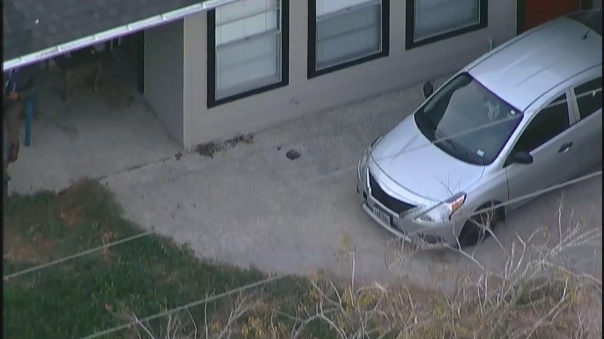

---  
staged: true  
category: P03/50-to-59-Investigation/53-Timeline  
jid: P03.53.02  
pro: P03  
ac: "53"  
id: "02"  
jarea: 50-59 Investigation  
jcat: 53 Timeline  
desc: Detailed timeline of events.  
friendlyname: Detailed Timeline  
title: 02-Detailed-Timeline  
aliases:  
  - P03-53-02  
  - Detailed Timeline  
cssclasses:  
  - wide-table  
---  
  
>[!info]- Location: P03.53.02  
>**Area:** P03 - 50-59 Investigation  
>**Category:** 53 - 53 Timeline  
>**ID:** 02 - Detailed Timeline  
  
# Detailed Timeline  
  
---  
# 2009  
  
1. [Magen Fieramusca](../../70-to-79-People/72-Suspects-and-People-of-Interest/01-Magen-Rose-Fieramusca.md#.md#) (also known as [Maygen Humphrey](../../70-to-79-People/72-Suspects-and-People-of-Interest/01-Magen-Rose-Fieramusca.md#)) and [Heidi Broussard](../../70-to-79-People/71-Victims/01-Heidi-Broussard.md#) became friends after attending the Texas Bible Institute in Columbus, Texas. ^rz8jc  
	1. They quickly became best friends and spoke on the phone regularly.[^55] ^q2gi3  
  
|  |  
| :--------------------------------------------------------------------------------------------------------------------: |  
| *[Magen Fieramusca](../../70-to-79-People/72-Suspects-and-People-of-Interest/01-Magen-Rose-Fieramusca.md#.md#) and [Heidi Broussard](../../70-to-79-People/71-Victims/01-Heidi-Broussard.md#.md#) at the church camp where they first met*                                                                                                                     |  
  
|  |  
|:-------------:|  
|    *[Heidi Broussard](../../70-to-79-People/71-Victims/01-Heidi-Broussard.md#.md#.md#) photo of [Magen Fieramusca](../../70-to-79-People/72-Suspects-and-People-of-Interest/01-Magen-Rose-Fieramusca.md#.md#) in 2013*    |  
  
|  |  
|:-------------:|  
|    *[Heidi Broussard](../../70-to-79-People/71-Victims/01-Heidi-Broussard.md#.md#.md#) and [Magen Fieramusca](../../70-to-79-People/72-Suspects-and-People-of-Interest/01-Magen-Rose-Fieramusca.md#.md#) in 2013*    |  
  
---  
## 2019  
  
1. [Magen Fieramusca](../../70-to-79-People/72-Suspects-and-People-of-Interest/01-Magen-Rose-Fieramusca.md#.md#) and [Heidi Broussard](../../70-to-79-People/71-Victims/01-Heidi-Broussard.md#.md#) both became pregnant at around the same time.[^56] ^nwgaj  
	1. Both expectant mothers were due in late 2019.[^57] ^qfxz2  
	2. [Shane Carey](../../70-to-79-People/73-Family-and-Friends/01-Shane-Carey.md#) claimed to have seen [Magen Fieramusca](../../70-to-79-People/72-Suspects-and-People-of-Interest/01-Magen-Rose-Fieramusca.md#.md#) visibly pregnant in person.[^58]   
	3. [Magen Fieramusca](../../70-to-79-People/72-Suspects-and-People-of-Interest/01-Magen-Rose-Fieramusca.md#.md#) held her hands to her apparently pregnant stomach, appearing to support the weight of her unborn child.[^59]   
	4. [Heidi Broussard](../../70-to-79-People/71-Victims/01-Heidi-Broussard.md#.md#.md#) and [Magen Fieramusca](../../70-to-79-People/72-Suspects-and-People-of-Interest/01-Magen-Rose-Fieramusca.md#.md#) had discussed the possibility of delivering on the same date.[^60] ^wwjws  
  
|  |  
|:-------------:|  
|    *[Heidi Broussard](../../70-to-79-People/71-Victims/01-Heidi-Broussard.md#.md#.md#) pregnant*    |  
  
|  |  
|:-------------:|  
|    *[Shane Carey](../../70-to-79-People/73-Family-and-Friends/01-Shane-Carey.md#) and a pregnant [Heidi Broussard](../../70-to-79-People/71-Victims/01-Heidi-Broussard.md#.md#.md#) *    |  
  
|  |  
|:-------------:|  
|    *[Shane Carey](../../70-to-79-People/73-Family-and-Friends/01-Shane-Carey.md#) and a pregnant [Heidi Broussard](../../70-to-79-People/71-Victims/01-Heidi-Broussard.md#.md#.md#) at the beach*    |  
  
---  
## [Monday November 25th 2019](../../10-to-19-Case-Dates/11-Background-Dates/2019-11-25-Monday-November-25th-2019.md#)   
  
1. [Heidi Broussard](../../70-to-79-People/71-Victims/01-Heidi-Broussard.md#.md#.md#)'s water broke early in the morning.[^61] ^0pthu  
	1. [Shane Carey](../../70-to-79-People/73-Family-and-Friends/01-Shane-Carey.md#) and [Heidi Broussard](../../70-to-79-People/71-Victims/01-Heidi-Broussard.md#.md#.md#) went to St. David's South Austin Hospital for medical treatment in anticipation of childbirth.[^62] ^fw28-  
	2. [Magen Fieramusca](../../70-to-79-People/72-Suspects-and-People-of-Interest/01-Magen-Rose-Fieramusca.md#.md#) was told that [Heidi Broussard](../../70-to-79-People/71-Victims/01-Heidi-Broussard.md#.md#.md#) had gone into labour.[^63]   
  
---  
## [Tuesday November 26th 2019](../../10-to-19-Case-Dates/11-Background-Dates/2019-11-26-Tuesday-November-26th-2019.md#)   
  
1. [Magen Fieramusca](../../70-to-79-People/72-Suspects-and-People-of-Interest/01-Magen-Rose-Fieramusca.md#.md#) drove from her home in Houston Texas to South Austin while she, herself, had been approximately 37 weeks pregnant.[^64] ^8tivp  
	1. Data from license plate readers between Houston and Austin confirmed that the car operated by [Magen Fieramusca](../../70-to-79-People/72-Suspects-and-People-of-Interest/01-Magen-Rose-Fieramusca.md#.md#) was travelling in the direction of Austin.[^81] [^82]   
	2. That afternoon, [Heidi](../../70-to-79-People/71-Victims/01-Heidi-Broussard.md#.md#.md#.md#.md#.md#.md#.md#.md#.md#.md#.md#.md#) and [Shane](../../70-to-79-People/73-Family-and-Friends/01-Shane-Carey.md#.md#.md#.md#.md#) gave [Magen Fieramusca](../../70-to-79-People/72-Suspects-and-People-of-Interest/01-Magen-Rose-Fieramusca.md#.md#) a key to their [apartment](../52-Key-Locations/01-Apartment.md#) from [Heidi's keyring](../../60-to-69-Evidence/63-Physical/03-Heidi-Keys.md#).[^65] ^z1084  
	3. A nurse that would later be spoken to by the authorities[^67] , [Nurse S.D](../../70-to-79-People/74-Witnesses/01-Nurse-SD.md#), overheard [Heidi](../../70-to-79-People/71-Victims/01-Heidi-Broussard.md#.md#.md#.md#.md#.md#.md#.md#.md#.md#.md#.md#.md#) and [Magen](../../70-to-79-People/72-Suspects-and-People-of-Interest/01-Magen-Rose-Fieramusca.md#.md#.md#.md#.md#.md#.md#.md#.md#.md#.md#.md#.md#.md#.md#.md#.md#) discussing the fact that [Magen](../../70-to-79-People/72-Suspects-and-People-of-Interest/01-Magen-Rose-Fieramusca.md#.md#.md#.md#.md#.md#.md#.md#.md#.md#.md#.md#.md#) had been 37 weeks pregnant.[^66]   
3. [Heidi Broussard](../../70-to-79-People/71-Victims/01-Heidi-Broussard.md#.md#.md#) delivered her [Newborn Child](../../70-to-79-People/73-Family-and-Friends/02-Newborn-Child.md#).[^68] ^o-3ze  
	1. The following people were in the room when she delivered her [Newborn Child](../../70-to-79-People/73-Family-and-Friends/02-Newborn-Child.md#.md#):[^69] ^emqq4  
		1. [Shane Carey](../../70-to-79-People/73-Family-and-Friends/01-Shane-Carey.md#), the Father of the baby.[^70] ^bko9m  
		2. [V.S](../../70-to-79-People/73-Family-and-Friends/04-VS.md#) (unclear who V.S is)[^71] ^95i06  
		3. [Magen Fieramusca](../../70-to-79-People/72-Suspects-and-People-of-Interest/01-Magen-Rose-Fieramusca.md#.md#), [Heidi](../../70-to-79-People/71-Victims/01-Heidi-Broussard.md#.md#.md#.md#.md#.md#.md#.md#.md#.md#.md#.md#.md#)'s best friend.[^72] ^fnfgw  
	2. Additional family members entered the room after the birth.[^73] ^lkbsx  
	3. The [Newborn Child](../../70-to-79-People/73-Family-and-Friends/02-Newborn-Child.md#.md#) was first held by [Heidi Broussard](../../70-to-79-People/71-Victims/01-Heidi-Broussard.md#.md#.md#), then by [Shane Carey](../../70-to-79-People/73-Family-and-Friends/01-Shane-Carey.md#), then by [V.S](../../70-to-79-People/73-Family-and-Friends/04-VS.md#), and then by [Shane Carey's Father](../../70-to-79-People/73-Family-and-Friends/05-Shane-Careys-Father.md#).[^75] ^n1ye4  
		1. Immediately after [Shane Carey's Father](../../70-to-79-People/73-Family-and-Friends/05-Shane-Careys-Father.md#.md#) was handed his grandchild ([newborn child](../../70-to-79-People/73-Family-and-Friends/02-Newborn-Child.md#.md#.md#.md#.md#.md#.md#.md#.md#.md#.md#.md#.md#)), [Magen](../../70-to-79-People/72-Suspects-and-People-of-Interest/01-Magen-Rose-Fieramusca.md#.md#.md#.md#.md#.md#.md#.md#.md#.md#.md#.md#.md#.md#.md#) interjected herself and asked to hold the [newborn child](../../70-to-79-People/73-Family-and-Friends/02-Newborn-Child.md#.md#.md#.md#) as she needed to leave.[^74] ^6ot-y  
		2. [Shane Carey's Father](../../70-to-79-People/73-Family-and-Friends/05-Shane-Careys-Father.md#.md#) was surprised by the actions of [Magen](../../70-to-79-People/72-Suspects-and-People-of-Interest/01-Magen-Rose-Fieramusca.md#.md#.md#.md#.md#.md#.md#.md#.md#.md#.md#.md#.md#.md#.md#.md#) and that his first introduction and time with his grandchild ([newborn child](../../70-to-79-People/73-Family-and-Friends/02-Newborn-Child.md#.md#.md#.md#.md#)) was interrupted by a friend of [Heidi](../../70-to-79-People/71-Victims/01-Heidi-Broussard.md#.md#.md#.md#.md#.md#.md#.md#.md#.md#.md#.md#.md#)'s.[^76] ^awfv6  
	4. [Magen](../../70-to-79-People/72-Suspects-and-People-of-Interest/01-Magen-Rose-Fieramusca.md#.md#.md#.md#.md#.md#.md#.md#.md#.md#.md#.md#.md#.md#.md#.md#.md#) told [Shane](../../70-to-79-People/73-Family-and-Friends/01-Shane-Carey.md#.md#.md#.md#.md#.md#.md#.md#) that she would leave the key to their [apartment](../52-Key-Locations/01-Apartment.md#.md#.md#.md#.md#.md#.md#.md#.md#.md#.md#.md#.md#.md#) on the counter inside the [apartment](../52-Key-Locations/01-Apartment.md#.md#).[^77] ^qavby  
		1. Neither [Shane](../../70-to-79-People/73-Family-and-Friends/01-Shane-Carey.md#.md#.md#.md#.md#.md#.md#.md#.md#) nor [Heidi](../../70-to-79-People/71-Victims/01-Heidi-Broussard.md#.md#.md#.md#.md#.md#.md#.md#.md#.md#.md#.md#.md#) could ever locate the [apartment](../52-Key-Locations/01-Apartment.md#.md#.md#.md#.md#.md#.md#.md#.md#.md#.md#.md#.md#.md#) key that [Magen](../../70-to-79-People/72-Suspects-and-People-of-Interest/01-Magen-Rose-Fieramusca.md#.md#.md#.md#.md#.md#.md#.md#.md#.md#.md#.md#.md#.md#.md#.md#.md#) had been given that granted her access to their [apartment](../52-Key-Locations/01-Apartment.md#.md#.md#).[^78] ^b10l7  
	5. [Magen](../../70-to-79-People/72-Suspects-and-People-of-Interest/01-Magen-Rose-Fieramusca.md#.md#.md#.md#.md#.md#.md#.md#.md#.md#.md#.md#.md#.md#.md#.md#.md#) left the hospital no more than one hour after [Heidi](../../70-to-79-People/71-Victims/01-Heidi-Broussard.md#.md#.md#.md#.md#.md#.md#.md#.md#.md#.md#.md#.md#) had given birth, and returned to [Heidi](../../70-to-79-People/71-Victims/01-Heidi-Broussard.md#.md#.md#.md#.md#.md#.md#.md#.md#.md#.md#.md#.md#) and [Shane](../../70-to-79-People/73-Family-and-Friends/01-Shane-Carey.md#.md#.md#.md#.md#)'s apartment, where she stayed until [November 27th 2019](../../10-to-19-Case-Dates/11-Background-Dates/2019-11-27-Wednesday-November-27th-2019.md#).[^79] ^9ww-8  
  
|  |  
|:-------------:|  
|    *[Heidi Broussard](../../70-to-79-People/71-Victims/01-Heidi-Broussard.md#.md#.md#) and [Newborn Child](../../70-to-79-People/73-Family-and-Friends/02-Newborn-Child.md#.md#) in the hospital*    |  
  
---  
## [Wednesday November 27th 2019](../../10-to-19-Case-Dates/11-Background-Dates/2019-11-27-Wednesday-November-27th-2019.md#.md#)   
  
1. [Magen Fieramusca](../../70-to-79-People/72-Suspects-and-People-of-Interest/01-Magen-Rose-Fieramusca.md#.md#) left [Heidi](../../70-to-79-People/71-Victims/01-Heidi-Broussard.md#.md#.md#.md#.md#.md#.md#.md#.md#.md#.md#.md#.md#) and [Shane](../../70-to-79-People/73-Family-and-Friends/01-Shane-Carey.md#.md#.md#.md#.md#)'s [apartment](../52-Key-Locations/01-Apartment.md#.md#.md#.md#) and returned to Houston, Texas.[^80]   
	1. [Magen Fieramusca](../../70-to-79-People/72-Suspects-and-People-of-Interest/01-Magen-Rose-Fieramusca.md#.md#) drove a grey 2015 [Nissan](../../60-to-69-Evidence/63-Physical/05-Magen-Nissan.md#) four door.  
  
|  |  
|:-------------:|  
|    *[Magen Fieramusca](../../70-to-79-People/72-Suspects-and-People-of-Interest/01-Magen-Rose-Fieramusca.md#.md#)'s [Nissan](../../60-to-69-Evidence/63-Physical/05-Magen-Nissan.md#.md#)*    |  
  
---  
## [Sunday December 8th 2019](../../10-to-19-Case-Dates/11-Background-Dates/2019-12-08-Sunday-December-8th-2019.md#) OR [Monday December 9th 2019](../../10-to-19-Case-Dates/11-Background-Dates/2019-12-09-Monday-December-9th-2019.md#)   
  
1. [Shane Carey](../../70-to-79-People/73-Family-and-Friends/01-Shane-Carey.md#) learned from [Heidi Broussard](../../70-to-79-People/71-Victims/01-Heidi-Broussard.md#.md#.md#) that [Magen Fieramusca](../../70-to-79-People/72-Suspects-and-People-of-Interest/01-Magen-Rose-Fieramusca.md#.md#) had given birth, and delivered a baby girl.[^83] ^c87z4  
	1. [Shane](../../70-to-79-People/73-Family-and-Friends/01-Shane-Carey.md#.md#.md#.md#.md#.md#.md#.md#.md#) did not see any photographs of the child.[^84] ^730a3  
  
---  
## [Thursday December 12th 2019](../../10-to-19-Case-Dates/12-Crime-Dates/2019-12-12-Thursday-December-12-2019.md#)   
  
1. [Shane Carey](../../70-to-79-People/73-Family-and-Friends/01-Shane-Carey.md#) stated that he last saw [Heidi Broussard](../../70-to-79-People/71-Victims/01-Heidi-Broussard.md#.md#.md#) and the [Newborn Child](../../70-to-79-People/73-Family-and-Friends/02-Newborn-Child.md#.md#) in person at approximately **6:30am**.[^7] ^qtkwe  
2. [Shane Carey](../../70-to-79-People/73-Family-and-Friends/01-Shane-Carey.md#) woke for work and saw [Heidi](../../70-to-79-People/71-Victims/01-Heidi-Broussard.md#.md#.md#.md#.md#.md#.md#.md#.md#.md#.md#.md#.md#) and the children before he left for work at a moving company in North Austin.[^8] ^clngu  
	1. [Shane Carey](../../70-to-79-People/73-Family-and-Friends/01-Shane-Carey.md#) stated that [Heidi](../../70-to-79-People/71-Victims/01-Heidi-Broussard.md#.md#.md#.md#.md#.md#.md#.md#.md#.md#.md#.md#.md#) would ready the children for the day, then take the six year old child to school at [Cowan Elementary](../52-Key-Locations/02-Cowan-Elementary.md#).[^9] ^s9z-3  
	2. Surveillance cameras at the school showed [Heidi Broussard](../../70-to-79-People/71-Victims/01-Heidi-Broussard.md#.md#.md#) entering and exiting the school with the [Newborn Child](../../70-to-79-People/73-Family-and-Friends/02-Newborn-Child.md#.md#),[^10] [^11]  leaving at approximately **8:12am**.[^12] ^3-70z  
	3. [Heidi](../../70-to-79-People/71-Victims/01-Heidi-Broussard.md#.md#.md#.md#.md#.md#.md#.md#.md#.md#.md#.md#.md#) was last seen wearing a purple-coloured shirt with long sleeves (as evidenced by the below picture) at [Cowan Elementary](../52-Key-Locations/02-Cowan-Elementary.md#.md#), but it was believed that she may have returned to her residence.[^192]   
  
|  |  
| :------------------------: |  
|  *Heidi at the school*                        |                                                                      |  
3. [Shane Carey](../../70-to-79-People/73-Family-and-Friends/01-Shane-Carey.md#) and [Heidi Broussard](../../70-to-79-People/71-Victims/01-Heidi-Broussard.md#.md#.md#) spoke on the phone at approximately **8:30am** regarding dropping the [Six Year Old Child](../../70-to-79-People/73-Family-and-Friends/03-Six-Year-Old-Child.md#) off at school, a conversation that was confirmed by a consent search of [Shane Carey](../../70-to-79-People/73-Family-and-Friends/01-Shane-Carey.md#)'s phone.[^13] ^zbrg7  
	1. He stated that he did not speak with [Heidi Broussard](../../70-to-79-People/71-Victims/01-Heidi-Broussard.md#.md#.md#) for the rest of his workday.[^14] ^zfwwp  
4. A friend of [Heidi](../../70-to-79-People/71-Victims/01-Heidi-Broussard.md#.md#.md#.md#.md#.md#.md#.md#.md#.md#.md#.md#.md#)'s posted to Facebook that she had gone to the book fair at around 8am at the school with the [Six Year Old Child](../../70-to-79-People/73-Family-and-Friends/03-Six-Year-Old-Child.md#.md#).[^197] ^bpl31  
5. Video captured on exterior cameras of a residence in the same complex as [Heidi](../../70-to-79-People/71-Victims/01-Heidi-Broussard.md#.md#.md#.md#.md#.md#.md#.md#.md#.md#.md#.md#.md#) and [Shane](../../70-to-79-People/73-Family-and-Friends/01-Shane-Carey.md#.md#.md#.md#.md#)'s [apartment](../52-Key-Locations/01-Apartment.md#.md#.md#.md#.md#) complex show a light coloured four door vehicle with the outline, window placement, and general appearance consistent with [Magen](../../70-to-79-People/72-Suspects-and-People-of-Interest/01-Magen-Rose-Fieramusca.md#.md#.md#.md#.md#.md#.md#.md#.md#.md#.md#.md#.md#.md#.md#.md#.md#)'s 2015 [Nissan](../../60-to-69-Evidence/63-Physical/05-Magen-Nissan.md#.md#.md#) driving northbound towards the rear of the complex at approximately **9:05am**.[^85] ^rj07b  
	1. [Heidi](../../70-to-79-People/71-Victims/01-Heidi-Broussard.md#.md#.md#.md#.md#.md#.md#.md#.md#.md#.md#.md#.md#) and [Shane](../../70-to-79-People/73-Family-and-Friends/01-Shane-Carey.md#.md#.md#.md#.md#)'s [apartment](../52-Key-Locations/01-Apartment.md#.md#.md#.md#.md#) is at the rear of the complex.[^86] ^d-bv9  
6. [Shane Carey](../../70-to-79-People/73-Family-and-Friends/01-Shane-Carey.md#) finished work at approximately **1:50pm** and called [Heidi Broussard](../../70-to-79-People/71-Victims/01-Heidi-Broussard.md#.md#.md#).[^15] ^20k-5  
	1. The phone call was not answered and went to voicemail.[^16] ^pd2jc  
7. [Shane Carey](../../70-to-79-People/73-Family-and-Friends/01-Shane-Carey.md#) arrived in the parking lot of their [apartment](../52-Key-Locations/01-Apartment.md#.md#.md#.md#.md#.md#.md#) complex at approximately **2:50pm**.[^17]   
	1. [Shane Carey](../../70-to-79-People/73-Family-and-Friends/01-Shane-Carey.md#) noticed that [Heidi Broussard](../../70-to-79-People/71-Victims/01-Heidi-Broussard.md#.md#.md#)'s vehicle, a white 2012 [Honda Fit](../../60-to-69-Evidence/63-Physical/01-Honda-Fit.md#), was parked in the parking lot of their [apartment](../52-Key-Locations/01-Apartment.md#.md#.md#.md#.md#.md#.md#.md#) complex.[^18] ^0yhj1  
	2. [Shane Carey](../../70-to-79-People/73-Family-and-Friends/01-Shane-Carey.md#) found the front door to their [apartment](../52-Key-Locations/01-Apartment.md#.md#.md#.md#.md#.md#.md#.md#.md#) to be unlocked.[^19]   
	3. [Shane Carey](../../70-to-79-People/73-Family-and-Friends/01-Shane-Carey.md#) stated that it wasn't unusual for the front door to be unlocked.[^20] ^iwo68  
	4. [Shane Carey](../../70-to-79-People/73-Family-and-Friends/01-Shane-Carey.md#) stated that the [apartment](../52-Key-Locations/01-Apartment.md#.md#.md#.md#.md#.md#.md#.md#.md#.md#) was not in disarray, and nothing inside seemed to be out of the ordinary.[^21] ^n-840  
	5. Neither [Heidi Broussard](../../70-to-79-People/71-Victims/01-Heidi-Broussard.md#.md#.md#) nor the [Newborn Child](../../70-to-79-People/73-Family-and-Friends/02-Newborn-Child.md#.md#) were inside.[^22] ^3vsd2  
	6. [Shane Carey](../../70-to-79-People/73-Family-and-Friends/01-Shane-Carey.md#) believed that [Heidi](../../70-to-79-People/71-Victims/01-Heidi-Broussard.md#.md#.md#.md#.md#.md#.md#.md#.md#.md#.md#.md#.md#) and the [Newborn Child](../../70-to-79-People/73-Family-and-Friends/02-Newborn-Child.md#.md#) were possibly visiting another apartment in the complex, or were at the park.[^23] ^e43us  
  
|                                                                                             |  
|:------------------------------------------------------------------------------------------------------------------------------------------------------------------------:|  
| *[Heidi Broussard](../../70-to-79-People/71-Victims/01-Heidi-Broussard.md#.md#.md#) and [Shane Carey](../../70-to-79-People/73-Family-and-Friends/01-Shane-Carey.md#)'s apartment* |                                                                                                                                                                      |  
  
|                                                                                             |  
| :--------------------------------------------------------------------------------------------------------------------------------------------------------------------------------------: |  
| *Front door to [Heidi Broussard](../../70-to-79-People/71-Victims/01-Heidi-Broussard.md#.md#.md#) and [Shane Carey](../../70-to-79-People/73-Family-and-Friends/01-Shane-Carey.md#)'s apartment* |  
  
|  |  
|:-------------:|  
|    *[Heidi Broussard](../../70-to-79-People/71-Victims/01-Heidi-Broussard.md#.md#.md#)'s Toyota*    |  
  
5. [Shane Carey](../../70-to-79-People/73-Family-and-Friends/01-Shane-Carey.md#) realised as the day progressed that their [Six Year Old Child](../../70-to-79-People/73-Family-and-Friends/03-Six-Year-Old-Child.md#.md#.md#) needed to be picked up from after-school activities.[^24] ^n1oli  
	1. He received a phone call from [Cowan Elementary](../52-Key-Locations/02-Cowan-Elementary.md#.md#.md#) to say that the [Six Year Old Child](../../70-to-79-People/73-Family-and-Friends/03-Six-Year-Old-Child.md#.md#.md#.md#) had not been picked up.[^195] ^x6qhm  
6. [Shane Carey](../../70-to-79-People/73-Family-and-Friends/01-Shane-Carey.md#) went to pick up the [Six Year Old Child](../../70-to-79-People/73-Family-and-Friends/03-Six-Year-Old-Child.md#.md#.md#.md#.md#) at approximately **5:50pm**, thinking that [Heidi Broussard](../../70-to-79-People/71-Victims/01-Heidi-Broussard.md#.md#.md#) would be there as well.[^25] ^qoydt  
7. [Shane Carey](../../70-to-79-People/73-Family-and-Friends/01-Shane-Carey.md#) waited until after **6:00pm**, but [Heidi Broussard](../../70-to-79-People/71-Victims/01-Heidi-Broussard.md#.md#.md#) did not arrive to pick up their child.[^26] ^y4lc0  
8. [Shane Carey](../../70-to-79-People/73-Family-and-Friends/01-Shane-Carey.md#) returned to the [apartment](../52-Key-Locations/01-Apartment.md#.md#.md#.md#.md#.md#.md#.md#.md#.md#.md#) with the [Six Year Old Child](../../70-to-79-People/73-Family-and-Friends/03-Six-Year-Old-Child.md#.md#.md#.md#.md#.md#).[^27] ^8so8t  
	1. Neither [Heidi Broussard](../../70-to-79-People/71-Victims/01-Heidi-Broussard.md#.md#.md#) nor [Newborn Child](../../70-to-79-People/73-Family-and-Friends/02-Newborn-Child.md#.md#) were at the [apartment](../52-Key-Locations/01-Apartment.md#.md#.md#.md#.md#.md#.md#.md#.md#.md#.md#.md#).[^28] ^xl4kl  
9. Shane went to [Heidi](../../70-to-79-People/71-Victims/01-Heidi-Broussard.md#.md#.md#.md#.md#.md#.md#.md#.md#.md#.md#.md#.md#)'s [Honda Fit](../../60-to-69-Evidence/63-Physical/01-Honda-Fit.md#.md#) which was in the parking lot, and found it to be unlocked.[^29] ^wr7z8  
	1. [Shane Carey](../../70-to-79-People/73-Family-and-Friends/01-Shane-Carey.md#) stated that it was unusual to him that the vehicle was unlocked.[^30] ^cq80u  
	2. He looked inside and saw [Heidi](../../70-to-79-People/71-Victims/01-Heidi-Broussard.md#.md#.md#.md#.md#.md#.md#.md#.md#.md#.md#.md#.md#)'s red purse.[^31] ^kd5dl  
	3. [Shane](../../70-to-79-People/73-Family-and-Friends/01-Shane-Carey.md#.md#.md#.md#.md#.md#.md#.md#.md#) looked inside the red purse and found [Heidi](../../70-to-79-People/71-Victims/01-Heidi-Broussard.md#.md#.md#.md#.md#.md#.md#.md#.md#.md#.md#.md#.md#)'s wallet.[^32] ^iorwb  
	4. All personal items, cash, credit cards, debit cards, and identification appeared to still be inside the wallet.[^33] ^2p5yz  
10. The [Newborn Child](../../70-to-79-People/73-Family-and-Friends/02-Newborn-Child.md#.md#) had jaundice when discharged from the hospital[^34] , and [Shane](../../70-to-79-People/73-Family-and-Friends/01-Shane-Carey.md#.md#.md#.md#.md#.md#.md#.md#.md#) and [Heidi](../../70-to-79-People/71-Victims/01-Heidi-Broussard.md#.md#.md#.md#.md#.md#.md#.md#.md#.md#.md#.md#.md#) had to supplement breast milk with formula due to the jaundice.[^35] ^vo9pl  
	1. All necessities for caring for a [newborn child](../../70-to-79-People/73-Family-and-Friends/02-Newborn-Child.md#.md#.md#.md#.md#.md#.md#.md#.md#.md#.md#.md#.md#) remained in the [apartment](../52-Key-Locations/01-Apartment.md#.md#.md#.md#.md#.md#.md#.md#.md#.md#.md#.md#.md#), including, but not limited to; diapers, formula, clothing, wipes, bedding, car safety seating, and accessories.[^36] ^nlen8  
	2. All apparent forms of financial means for [Heidi Broussard](../../70-to-79-People/71-Victims/01-Heidi-Broussard.md#.md#.md#) appear to be inside her wallet, which was left in her vehicle.[^37] ^dkm48  
	3. The only items of note missing from the [apartment](../52-Key-Locations/01-Apartment.md#.md#.md#.md#.md#.md#.md#.md#.md#.md#.md#.md#.md#.md#) or from [Heidi](../../70-to-79-People/71-Victims/01-Heidi-Broussard.md#.md#.md#.md#.md#.md#.md#.md#.md#.md#.md#.md#.md#)'s [Honda Fit](../../60-to-69-Evidence/63-Physical/01-Honda-Fit.md#.md#) had been [Heidi](../../70-to-79-People/71-Victims/01-Heidi-Broussard.md#.md#.md#.md#.md#.md#.md#.md#.md#.md#.md#.md#.md#)'s [iPhone 11](../../60-to-69-Evidence/63-Physical/02-Heidi-Cell-Phone.md#) and her [keys](../../60-to-69-Evidence/63-Physical/03-Heidi-Keys.md#.md#).[^38] ^rciwu  
		1. The [iPhone 11](../../60-to-69-Evidence/63-Physical/02-Heidi-Cell-Phone.md#.md#) was black in colour and in a case with red, white and blue colours in a tie-dye pattern.[^39]   
		2. The [keys](../../60-to-69-Evidence/63-Physical/03-Heidi-Keys.md#.md#.md#) consisted of three or four keys on a key ring with a [Honda Fit](../../60-to-69-Evidence/63-Physical/01-Honda-Fit.md#.md#.md#.md#) chip enabled car key, and with one key on the ring having blue tape on it.[^40]   
11. [Shane Carey](../../70-to-79-People/73-Family-and-Friends/01-Shane-Carey.md#) began to call friends and family in the area in an attempt to find [Heidi](../../70-to-79-People/71-Victims/01-Heidi-Broussard.md#.md#.md#.md#.md#.md#.md#.md#.md#.md#.md#.md#.md#) and their [Newborn Child](../../70-to-79-People/73-Family-and-Friends/02-Newborn-Child.md#.md#) without success.[^41] ^-samr  
12. At approximately **7:31pm**, [Shane Carey](../../70-to-79-People/73-Family-and-Friends/01-Shane-Carey.md#) called the Austin Police Department to report [Heidi Broussard](../../70-to-79-People/71-Victims/01-Heidi-Broussard.md#.md#.md#) and the [Newborn Child](../../70-to-79-People/73-Family-and-Friends/02-Newborn-Child.md#.md#) as missing.[^42]   
13. [Officer Parker](../../70-to-79-People/75-Police-and-Detectives/16-Officer-Parker.md#) was dispatched to a call regarding a missing adult female, [Heidi Broussard](../../70-to-79-People/71-Victims/01-Heidi-Broussard.md#.md#.md#), and her two week old [Newborn Child](../../70-to-79-People/73-Family-and-Friends/02-Newborn-Child.md#.md#).[^1] ^onej6  
14. The boyfriend of missing [Heidi Broussard](../../70-to-79-People/71-Victims/01-Heidi-Broussard.md#.md#.md#), [Shane Carey](../../70-to-79-People/73-Family-and-Friends/01-Shane-Carey.md#), had been the one to report her as missing and together they shared two children; [Newborn Child](../../70-to-79-People/73-Family-and-Friends/02-Newborn-Child.md#.md#) and [Six Year Old Child](../../70-to-79-People/73-Family-and-Friends/03-Six-Year-Old-Child.md#.md#.md#.md#.md#.md#.md#).[^2]   
15. [Shane Carey](../../70-to-79-People/73-Family-and-Friends/01-Shane-Carey.md#), [Heidi Broussard](../../70-to-79-People/71-Victims/01-Heidi-Broussard.md#.md#.md#), and both children live together in an apartment at `7`REDACTED` West William Cannon Drive, in Austin, Travis County, Texas`.[^3]   
16. Responding officers conducted a deliberate search of the area of the [apartment](../52-Key-Locations/01-Apartment.md#.md#.md#.md#.md#.md#.md#.md#.md#.md#.md#.md#.md#.md#), contacted members of [Heidi Broussard](../../70-to-79-People/71-Victims/01-Heidi-Broussard.md#.md#.md#)'s family and friend group, conducted a "[Reverse 911](https://www.wikiwand.com/en/Reverse_9-1-1)", calling over 4,000 residences in the immediate area of the [apartment](../52-Key-Locations/01-Apartment.md#.md#.md#.md#.md#.md#.md#.md#.md#.md#.md#.md#.md#.md#), and released the names of images of [Heidi Broussard](../../70-to-79-People/71-Victims/01-Heidi-Broussard.md#.md#.md#) and the [Newborn Child](../../70-to-79-People/73-Family-and-Friends/02-Newborn-Child.md#.md#) to the media, all without locating [Heidi Broussard](../../70-to-79-People/71-Victims/01-Heidi-Broussard.md#.md#.md#) nor her [Newborn Child](../../70-to-79-People/73-Family-and-Friends/02-Newborn-Child.md#.md#) .[^43] ^pvved  
  
---  
## [Friday December 13th 2019](../../10-to-19-Case-Dates/13-Investigation-Dates/2019-12-13-Friday-December-13-2019.md#)   
  
1. [Shane Carey](../../70-to-79-People/73-Family-and-Friends/01-Shane-Carey.md#) provided an initial statement to Austin Police Detectives [Brad Herries](../../70-to-79-People/75-Police-and-Detectives/01-Detective-Herries.md#) and [Ryan Metcalf](../../70-to-79-People/75-Police-and-Detectives/02-Detective-Metcalf.md#), at the Austin Police Department South Substation.[^4] ^d4ayu  
	1. [Shane Carey](../../70-to-79-People/73-Family-and-Friends/01-Shane-Carey.md#) cooperated with the police.[^5] ^ot1g7  
	2. The conversation was voluntary and recorded.[^6] ^27nai  
2. [Detective Herries](../../70-to-79-People/75-Police-and-Detectives/01-Detective-Herries.md#.md#) researched [Heidi Broussard](../../70-to-79-People/71-Victims/01-Heidi-Broussard.md#.md#.md#)'s phone number using an online tool and identified several facts.[^44] ^ksbyo  
	1. The number was registered to [Shane Carey](../../70-to-79-People/73-Family-and-Friends/01-Shane-Carey.md#).[^45] ^prq53  
	2. The service provider had been T-Mobile.[^46] ^rubu-  
		1. T-Mobile was contacted and confirmed it provided service for the number, and that the phone was currently showing to be on and active.[^47] ^ideh8  
3. A Surveillance Order with an Emergent Addendum was sworn to by [Detective Herries](../../70-to-79-People/75-Police-and-Detectives/01-Detective-Herries.md#.md#) and was presented to Travis County District Court [Judge J. Kocurek](../../70-to-79-People/77-Legal-Teams/01-Judge-Kocurek.md#).[^48] ^3nagl  
	1. [Judge J. Kocurek](../../70-to-79-People/77-Legal-Teams/01-Judge-Kocurek.md#.md#) reviewed the Order and approved the document.[^49] ^fxyz7  
4. An emergency ping for [Heidi Broussard](../../70-to-79-People/71-Victims/01-Heidi-Broussard.md#.md#.md#)'s phone number began at approximately **4:56pm** on [Friday December 13th 2019](../../10-to-19-Case-Dates/13-Investigation-Dates/2019-12-13-Friday-December-13-2019.md#) and ran continuously until the afternoon of [Sunday December 15th 2019](../../10-to-19-Case-Dates/13-Investigation-Dates/2019-12-15-Sunday-December-15-2019.md#).[^50] ^pcazx  
	1. This continuous ping was requested to ascertain locational data associated with the use of the phone.[^51]  ^j5agv  
	2. The data was updated and sent at fifteen minute intervals for the 48 hour period.[^52] ^wuina  
  
---  
## [Saturday December 14th 2019](../../10-to-19-Case-Dates/13-Investigation-Dates/2019-12-14-Saturday-December-14th-2019.md#)  
  
1. An Austin Police helicopter circled the area of [Heidi Broussard](../../70-to-79-People/71-Victims/01-Heidi-Broussard.md#.md#.md#)'s [apartment](../52-Key-Locations/01-Apartment.md#.md#.md#.md#.md#.md#.md#.md#.md#.md#.md#.md#.md#.md#) as part of the search, with K9 units provided by Game Wardens to assist.[^193] ^7uuxr  
2. [Shane Carey](../../70-to-79-People/73-Family-and-Friends/01-Shane-Carey.md#) made a public plea:(see [01-Web-Sleuths-Timeline-Thread](../../40-to-49-Articles/41-Article-Archive/01-Web-Sleuths-Timeline-Thread.md#vhk8d)) ^ta-q-  
  
>[!quote] [Shane Carey](../../70-to-79-People/73-Family-and-Friends/01-Shane-Carey.md#)  
>"I went to work, and I talked to her around 8 o'clock and that's the last time I talked to her"   
>  
>(...)  
>  
>"If you see an awesome mom with a baby walking around or in a suspicious van or car or anything, please just somebody call"  
  
3. It was reported in the press that [Heidi Broussard](../../70-to-79-People/71-Victims/01-Heidi-Broussard.md#.md#.md#)'s mother had indicated that there wasn't anything wrong with [Heidi](../../70-to-79-People/71-Victims/01-Heidi-Broussard.md#.md#.md#.md#.md#.md#.md#.md#.md#.md#.md#.md#.md#) leading up to her disappearance, and she couldn't think of a single person that would want to hurt her daughter.[^194] ^7bjue  
4. [Shane Carey](../../70-to-79-People/73-Family-and-Friends/01-Shane-Carey.md#) told the press over the phone:[^196] ^ufz7c  
  
>[!quote] [Shane Carey](../../70-to-79-People/73-Family-and-Friends/01-Shane-Carey.md#)  
>"I don't know why anybody would ever harm or touch these two beautiful women together"  
>  
>(..)  
>  
>"She is an amazing person"  
>  
>(..)  
>  
>"She has amazing support, friends behind her. She's so personable – one of the best people I've ever met, so kind, and she does anything for her kids – one of the best moms."  
>  
>(..)  
>  
>"We're all stumped because everything's over here – the car's over here"  
>  
>(..)  
>  
>"There's no signs of struggle. There's nothing, no evidence, so we're just trying to piece it together but there really are no pieces."   
>  
>(..)  
>  
>"I just don't see why no one heard any screams or anything out here so we're trying to put the puzzle pieces together"  
>  
>(..)  
>  
>"I just want her to come home"  
>  
>(..)  
>  
>"She's amazing. She's missed. She has her whole family here supporting, praying for her to come home, and hopefully that's just – I don't know – somebody to bring her home safe. I don't care, just drop her off."  
  
  
---  
## [Sunday December 15th 2019](../../10-to-19-Case-Dates/13-Investigation-Dates/2019-12-15-Sunday-December-15-2019.md#.md#)   
  
1. The continuous 48 hour ping of [Heidi Broussard](../../70-to-79-People/71-Victims/01-Heidi-Broussard.md#.md#.md#)'s cell phone came to an end in the afternoon.[^53]   
	1. There was no locational data reported for the 48 hour period, indicating that the phone had not been in use.[^54] ^vij9b  
2. [Shane Carey](../../70-to-79-People/73-Family-and-Friends/01-Shane-Carey.md#) makes an emotional plea in the press for [Heidi](../../70-to-79-People/71-Victims/01-Heidi-Broussard.md#.md#.md#.md#.md#.md#.md#.md#.md#.md#.md#.md#.md#) and the [Newborn Child](../../70-to-79-People/73-Family-and-Friends/02-Newborn-Child.md#.md#)'s return. ^t0q0n  
3. [Shane Carey](../../70-to-79-People/73-Family-and-Friends/01-Shane-Carey.md#) addressed facing scrutiny over [Heidi](../../70-to-79-People/71-Victims/01-Heidi-Broussard.md#.md#.md#.md#.md#.md#.md#.md#.md#.md#.md#.md#.md#)'s disappearance and insisted that he hadn't done anything wrong.[^198]   
  
<iframe title="Father makes plea for missing woman and baby's return | KVUE" src="https://www.youtube.com/embed/aO2MQBIqjYk?feature=oembed" height="113" width="200" style="aspect-ratio: 1.76991 / 1; width: 100%; height: 100%;" allowfullscreen="" allow="fullscreen"></iframe>   
  
<iframe title="RAW VIDEO: The Shane Carey Interview re Missing fiance Heidi Broussard &amp; Daughter" src="https://www.youtube.com/embed/v9MawfzHJss?feature=oembed" height="113" width="200" style="aspect-ratio: 1.76991 / 1; width: 100%; height: 100%;" allowfullscreen="" allow="fullscreen"></iframe>  
(Full transcript: see [01-Web-Sleuths-Timeline-Thread](Cases/P03-Heidi-Broussard/40-to-49-Articles/41-Article-Archive/01-Web-Sleuths-Timeline-Thread.md#^lr-fp))  
  
---  
## [Monday December 16th 2019](../../10-to-19-Case-Dates/13-Investigation-Dates/2019-12-16-Monday-December-16th-2019.md#)  
  
1. [Shane Carey's Father](../../70-to-79-People/73-Family-and-Friends/05-Shane-Careys-Father.md#.md#) told the press that he had setup a Facebook page on [December 15th 2019](../../10-to-19-Case-Dates/13-Investigation-Dates/2019-12-15-Sunday-December-15-2019.md#.md#.md#) to raise money for a reward and for "expenses incurred during the search".[^199] ^x8t14  
2. The FBI and Texas Rangers joined the search efforts.[^200] ^gaxcs  
3. The investigators were attempting to remain neutral and were avoiding jumping to any conclusions.[^201] ^kb7-3  
	1. They were working from two possible angles: that [Heidi Broussard](../../70-to-79-People/71-Victims/01-Heidi-Broussard.md#.md#.md#) left on her own accord, or that they were victims of foul-play.[^202] ^8q0ey  
	2. They interviewed the neighbours in the complex where [Heidi](../../70-to-79-People/71-Victims/01-Heidi-Broussard.md#.md#.md#.md#.md#.md#.md#.md#.md#.md#.md#.md#.md#) lived.[^203] ^96qvc  
	3. They also completed an analysis of the [apartment](../52-Key-Locations/01-Apartment.md#.md#.md#.md#.md#.md#.md#.md#.md#.md#.md#.md#.md#.md#) for any possible forensic evidence.[^204] ^s4ts3  
	4. Though, they hadn't turned up anything that answered their questions.[^205] ^1y75b  
4. An interview with [Shane Carey](../../70-to-79-People/73-Family-and-Friends/01-Shane-Carey.md#) by the press was published, [Shane Carey's Father](../../70-to-79-People/73-Family-and-Friends/05-Shane-Careys-Father.md#.md#) had also been present.[^233]   
  
<iframe src="https://drive.google.com/file/d/1ar0-acOrG9VgOt5gTRL8SiOCyvAehpz0/preview" width="640" height="480" allow="autoplay"></iframe>  
Transcript: see [01-Web-Sleuths-Timeline-Thread](../../40-to-49-Articles/41-Article-Archive/01-Web-Sleuths-Timeline-Thread.md#0nvfj)  
  
---  
## [Tuesday December 17th 2019](../../10-to-19-Case-Dates/13-Investigation-Dates/2019-12-17-Tuesday-December-17th-2019.md#)  
  
1. Search parties were organised which included one group who planned to use drones.[^206] ^v67ei  
2. Detectives obtained surveillance footage from any premises in the area around [Heidi](../../70-to-79-People/71-Victims/01-Heidi-Broussard.md#.md#.md#.md#.md#.md#.md#.md#.md#.md#.md#.md#.md#)'s [apartment](../52-Key-Locations/01-Apartment.md#.md#.md#.md#.md#.md#.md#.md#.md#.md#.md#.md#.md#.md#).[^207] ^v-k9h  
3. The FBI performed inspections of cars in the area.[^208] ^iwvup  
4. Investigators addressed the press and revealed the following information:[^211] ^ug-il  
	1. They had no leads on the whereabouts of [Heidi Broussard](../../70-to-79-People/71-Victims/01-Heidi-Broussard.md#.md#.md#) and the [Newborn Child](../../70-to-79-People/73-Family-and-Friends/02-Newborn-Child.md#.md#).[^209]   
	2. They had no persons of interest.[^210]   
	3. They stated that [Heidi](../../70-to-79-People/71-Victims/01-Heidi-Broussard.md#.md#.md#.md#.md#.md#.md#.md#.md#.md#.md#.md#.md#) could have left on her own, or "something nefarious" could be involved.[^212]   
	4. They stated that the case is unique.[^213]   
	5. They re-iterated that it's possible foul play is involved, and that it's also possible that [Heidi](../../70-to-79-People/71-Victims/01-Heidi-Broussard.md#.md#.md#.md#.md#.md#.md#.md#.md#.md#.md#.md#.md#) left on her own with the [Newborn Child](../../70-to-79-People/73-Family-and-Friends/02-Newborn-Child.md#.md#).[^214]   
	6. They said: "*at this time, we have no reason to believe that [Newborn Child](../../70-to-79-People/73-Family-and-Friends/02-Newborn-Child.md#.md#) nor [Heidi](../../70-to-79-People/71-Victims/01-Heidi-Broussard.md#.md#.md#.md#.md#.md#.md#.md#.md#.md#.md#.md#.md#) are harmed... our assumption is they are alive.*"[^215]   
	7. They revealed that no Amber Alert has been issued as the case didn't meet the criteria to issue an alert.[^216]   
  
<iframe title="Austin police provide update on missing mother &amp; baby investigation" src="https://www.youtube.com/embed/Lg2vYFQoJlY?feature=oembed" height="113" width="200" style="aspect-ratio: 1.76991 / 1; width: 100%; height: 100%;" allowfullscreen="" allow="fullscreen"></iframe>  
Transcript: see [01-Web-Sleuths-Timeline-Thread](Cases/P03-Heidi-Broussard/40-to-49-Articles/41-Article-Archive/01-Web-Sleuths-Timeline-Thread.md#^uf6em)  
  
---  
## [Wednesday December 18th 2019](../../10-to-19-Case-Dates/11-Background-Dates/2019-12-18-Wednesday-December-18th-2019.md#)   
  
1. [Heidi](../../70-to-79-People/71-Victims/01-Heidi-Broussard.md#.md#.md#.md#.md#.md#.md#.md#.md#.md#.md#.md#.md#)'s parents spoke out to the press.[^217] ^vyzav  
	1. "It's very hard. The more you think about it, the worse it gets," Broussard's dad told Good Morning America.  [^218]   
	2. Her parents believe the mother and child were taken and are pleading for her safe return.  [^219]   
	3. "She would not leave her son ... her kids are her heartbeat," Broussard's mom said.  [^220]   
2. According to one of [Heidi](../../70-to-79-People/71-Victims/01-Heidi-Broussard.md#.md#.md#.md#.md#.md#.md#.md#.md#.md#.md#.md#.md#)'s friends, she had spoken about her living arrangements, which was published in the press.[^221] ^7x9ux  
	1. [Heidi](../../70-to-79-People/71-Victims/01-Heidi-Broussard.md#.md#.md#.md#.md#.md#.md#.md#.md#.md#.md#.md#.md#) had told this friend that she wanted to move to a vacant home in Kyle, Texas, that belongs to [Shane Carey's Father](../../70-to-79-People/73-Family-and-Friends/05-Shane-Careys-Father.md#.md#).[^222] ^vf61c  
	2. The friend said that she had no idea that [Heidi](../../70-to-79-People/71-Victims/01-Heidi-Broussard.md#.md#.md#.md#.md#.md#.md#.md#.md#.md#.md#.md#.md#) hadn't moved to the home, and that the friend had been surprised to hear that she was still living in her Austin [apartment](../52-Key-Locations/01-Apartment.md#.md#.md#.md#.md#.md#.md#.md#.md#.md#.md#.md#.md#.md#).[^223] ^j93xz  
	3. The friend added that [Heidi](../../70-to-79-People/71-Victims/01-Heidi-Broussard.md#.md#.md#.md#.md#.md#.md#.md#.md#.md#.md#.md#.md#) planned to drive her son 40 minutes each way to a school in Austin so that the [Six Year Old Child](../../70-to-79-People/73-Family-and-Friends/03-Six-Year-Old-Child.md#.md#.md#.md#.md#.md#.md#.md#) could stay in a good school.[^224] ^nbxzo  
	4. *“She was willing to drive 40 minutes out of her way to have them in a better school. That’s not a mother that leaves…..I feel like everybody is focusing on her running away and knowing Heidi I doubt that.”* [^225]   
	5. The friend did relay this information to the investigators.[^226]   
	6. The friend also said that she had been surprised when [Heidi](../../70-to-79-People/71-Victims/01-Heidi-Broussard.md#.md#.md#.md#.md#.md#.md#.md#.md#.md#.md#.md#.md#) told her over the summer that she had gotten back together with [Shane Carey](../../70-to-79-People/73-Family-and-Friends/01-Shane-Carey.md#) as the pair had apparently previously broken up.[^227] ^3l-su  
	7. Further, the friend said that [Shane Carey](../../70-to-79-People/73-Family-and-Friends/01-Shane-Carey.md#)'s recent behaviour after [Heidi](../../70-to-79-People/71-Victims/01-Heidi-Broussard.md#.md#.md#.md#.md#.md#.md#.md#.md#.md#.md#.md#.md#) had disappeared differed from his previous behavior, when he allegedly showed up to her house almost immediately after [Heidi](../../70-to-79-People/71-Victims/01-Heidi-Broussard.md#.md#.md#.md#.md#.md#.md#.md#.md#.md#.md#.md#.md#) didn't answer her phone.[^228] ^eao8j  
	8. *“Why would that not scare you as a husband? I specifically remember a time she ([Heidi](../../70-to-79-People/71-Victims/01-Heidi-Broussard.md#.md#.md#.md#.md#.md#.md#.md#.md#.md#.md#.md#.md#)) was at my house and didn’t answer her phone. He ([Shane Carey](../../70-to-79-People/73-Family-and-Friends/01-Shane-Carey.md#)) showed up to my house freaking out right after he got home.”*  [^229]   
3. [Shane Carey](../../70-to-79-People/73-Family-and-Friends/01-Shane-Carey.md#) told the press that when he first noticed [Heidi](../../70-to-79-People/71-Victims/01-Heidi-Broussard.md#.md#.md#.md#.md#.md#.md#.md#.md#.md#.md#.md#.md#) was missing, he walked around the apartment complex 'going through dumpsters' to see if he could find her keys.[^230] ^w2lhh  
	1. *'I sat outside to see any suspicions, anything that was weird,'* he said.  [^231]   
	2. *'The next morning I sat out here for hours asking everybody if they'd seen or heard screaming, anything that was off or suspicious. They're all saying no.'*  [^232]   
4. An adult female, known as [M.W](../../70-to-79-People/74-Witnesses/02-MW.md#), provided a statement to [Detective Mireles](../../70-to-79-People/75-Police-and-Detectives/08-Detective-Mireles.md#) and [Detective Briegel](../../70-to-79-People/75-Police-and-Detectives/09-Detective-Briegel.md#) about the encounter she had on [December 12th 2019](../../10-to-19-Case-Dates/12-Crime-Dates/2019-12-12-Thursday-December-12-2019.md#.md#).[^87] ^v7gr4  
	1. [M.W](../../70-to-79-People/74-Witnesses/02-MW.md#) stated that on either [December 12th 2019](../../10-to-19-Case-Dates/12-Crime-Dates/2019-12-12-Thursday-December-12-2019.md#.md#.md#) or [December 11th 2019](../../10-to-19-Case-Dates/11-Background-Dates/2019-12-11-Wednesday-December-11th-2019.md#), she had been driving through the rear of the complex where [Heidi](../../70-to-79-People/71-Victims/01-Heidi-Broussard.md#.md#.md#.md#.md#.md#.md#.md#.md#.md#.md#.md#.md#) and [Shane](../../70-to-79-People/73-Family-and-Friends/01-Shane-Carey.md#.md#.md#.md#.md#) live.[^88] ^7zra3  
	2. She stated that she saw a four door vehicle, believed to be light in colour, stopped in the parking lot perpendicular to the provided parking spaces.[^89] ^ir38o  
	3. [M.W](../../70-to-79-People/74-Witnesses/02-MW.md#) stated that she saw a white adult female walk from between buildings 7 and 8 towards the vehicle.[^90] ^o2dxl  
	4. The adult white female was carrying a small infant who was wearing a knit cap.[^91] ^tepa9  
	5. The adult female walked towards the vehicle.[^92]   
	6. [M.W](../../70-to-79-People/74-Witnesses/02-MW.md#) saw a female exit the front passenger seat and greet the adult female who was carrying the small infant.[^93] ^lnmnm  
	7. The front seat passenger opened the rear passenger side door of the vehicle, the adult female entered the rear passenger seat, both doors closed, and the vehicle drove away.[^94] ^e0dcy  
	8. [M.W](../../70-to-79-People/74-Witnesses/02-MW.md#) stated that there had not been enough time for the adult female to secure the infant into any type of child restraint system before the vehicle drove away.[^95] ^28rkt  
	9. [M.W](../../70-to-79-People/74-Witnesses/02-MW.md#) turned from the main lane of the parking lot and last saw the four door vehicle driving towards the exit gate to South First.[^96] ^7ieyo  
5. [Shane](../../70-to-79-People/73-Family-and-Friends/01-Shane-Carey.md#.md#.md#.md#.md#.md#.md#.md#.md#) spoke with [Detective Faithful](../../70-to-79-People/75-Police-and-Detectives/03-Detective-Faithful.md#) and mentioned that [Heidi Broussard](../../70-to-79-People/71-Victims/01-Heidi-Broussard.md#.md#.md#) and [Magen Fieramusca](../../70-to-79-People/72-Suspects-and-People-of-Interest/01-Magen-Rose-Fieramusca.md#.md#) had been friends.[^103] ^my1wj  
	1. [Shane](../../70-to-79-People/73-Family-and-Friends/01-Shane-Carey.md#.md#.md#.md#.md#.md#.md#.md#.md#) provided [Magen Fieramusca](../../70-to-79-People/72-Suspects-and-People-of-Interest/01-Magen-Rose-Fieramusca.md#.md#)'s phone number to the police.[^104]   
		1. The number was serviced by T-Mobile.[^105] ^tjhqo  
6. That same day, [Intelligence Analyst Ferguson](../../70-to-79-People/75-Police-and-Detectives/11-Intelligence-Analyst-Ferguson.md#) of the FBI conducted open source research related to any social media presence for [Magen Fieramusca](../../70-to-79-People/72-Suspects-and-People-of-Interest/01-Magen-Rose-Fieramusca.md#.md#).[^106] ^xaz67  
7. A search of [Heidi Broussard](../../70-to-79-People/71-Victims/01-Heidi-Broussard.md#.md#.md#)'s contacts on Instagram revealed an Instagram account for user "`maygenhumphrey`".[^107] ^73zug  
8. [Intelligence Analyst Ferguson](../../70-to-79-People/75-Police-and-Detectives/11-Intelligence-Analyst-Ferguson.md#) obtained records for Instagram user "`maygenhumphrey`" via a Voluntary Emergency Disclosure.[^108] ^kkp4s  
	1. The records indicated the account was registered using an email containing the name [Maygen Humphrey](../../70-to-79-People/72-Suspects-and-People-of-Interest/01-Magen-Rose-Fieramusca.md#.md#.md#.md#.md#.md#.md#.md#.md#.md#.md#.md#.md#.md#.md#.md#.md#.md#.md#.md#.md#.md#.md#.md#.md#.md#.md#.md#).[^109] ^5oxc3  
	2. The account had been active for an extended period of time, and contained no posts.[^110] ^g0rhs  
9. Further research into [Maygen Humphrey](../../70-to-79-People/72-Suspects-and-People-of-Interest/01-Magen-Rose-Fieramusca.md#.md#.md#.md#.md#.md#.md#.md#.md#.md#.md#.md#.md#.md#.md#.md#.md#.md#.md#.md#.md#.md#.md#.md#.md#.md#.md#.md#), who they began to link as being a nickname for [Magen Fieramusca](../../70-to-79-People/72-Suspects-and-People-of-Interest/01-Magen-Rose-Fieramusca.md#.md#), yielded at least one photo on the Facebook profile of [Heidi Broussard](../../70-to-79-People/71-Victims/01-Heidi-Broussard.md#.md#.md#) and a white female who appeared to be tagged as [Maygen Humphrey](../../70-to-79-People/72-Suspects-and-People-of-Interest/01-Magen-Rose-Fieramusca.md#.md#.md#.md#.md#.md#.md#.md#.md#.md#.md#.md#.md#.md#.md#.md#.md#.md#.md#.md#.md#.md#.md#.md#.md#.md#.md#.md#).[^111] ^06oi-  
	1. The white female identified in the photo as [Maygen Humphrey](../../70-to-79-People/72-Suspects-and-People-of-Interest/01-Magen-Rose-Fieramusca.md#.md#.md#.md#.md#.md#.md#.md#.md#.md#.md#.md#.md#.md#.md#.md#.md#.md#.md#.md#.md#.md#.md#.md#.md#.md#.md#.md#) was visually similar to the known Texas Driver's License photo of [Magen Fieramusca](../../70-to-79-People/72-Suspects-and-People-of-Interest/01-Magen-Rose-Fieramusca.md#.md#).[^112] ^mo0cm  
10. [Intelligence Analyst Ferguson](../../70-to-79-People/75-Police-and-Detectives/11-Intelligence-Analyst-Ferguson.md#) requested records from Google related to the email address associated with the Instagram account "`maygenhumphrey`" via Voluntary Emergency Disclosure.[^113] ^omkl6  
	1. A review of the search history for the email identified a Google search for "`reasons for Amber Alert`" performed on [December 12th 2019](../../10-to-19-Case-Dates/12-Crime-Dates/2019-12-12-Thursday-December-12-2019.md#.md#.md#.md#), at **10:31pm** CST.[^114] ^6o-ci  
		1. To date, an official Amber Alert for the [Newborn Child](../../70-to-79-People/73-Family-and-Friends/02-Newborn-Child.md#.md#) has not been released via Austin Police Department or Texas Department of Public Safety.[^115] ^dxrap  
	2. A Google search was performed for "`Amber alert issued Austin`" on [December 12th 2019](../../10-to-19-Case-Dates/12-Crime-Dates/2019-12-12-Thursday-December-12-2019.md#.md#.md#.md#), at **10:42pm** CST.[^116] ^wqc9j  
		1. A result of this search, located at https://rare.us/rare-news/police-issue-amber-alert-for-3-year-old-baby-last-seen-at-austin-hospital/amp/, was visited on [December 12th 2019](../../10-to-19-Case-Dates/12-Crime-Dates/2019-12-12-Thursday-December-12-2019.md#.md#.md#.md#) at **10:42pm** CST.[^117]   
	3. A full review of searches performed between [November 11th 2019](../../10-to-19-Case-Dates/11-Background-Dates/2019-11-11-Monday-November-11th-2019.md#) and [December 18th 2019](../../10-to-19-Case-Dates/11-Background-Dates/2019-12-18-Wednesday-December-18th-2019.md#.md#) revealed some form of "[Heidi Broussard](../../70-to-79-People/71-Victims/01-Heidi-Broussard.md#.md#.md#)" was searched at least 162 times from a device utilizing the email account.[^118] ^r9jqa  
	4. On [December 14th 2019](../../10-to-19-Case-Dates/13-Investigation-Dates/2019-12-14-Saturday-December-14th-2019.md#.md#), a search was conducted for the words "`bodies found in Austin Texas`".[^119] ^1n472  
11. A follow-on request via Voluntary Emergency Disclosure for any Facebook or Instagram accounts related to the email address resulted in identification of a Facebook account with the vanity name `MAYGEN.HUMPHREY`.[^120] ^b1h5q  
	1. This account was active from 2008 until the account was terminated or deactivated on [December 17th 2019](../../10-to-19-Case-Dates/13-Investigation-Dates/2019-12-17-Tuesday-December-17th-2019.md#.md#) at **9:09pm** CST.[^121] ^vfbnc  
	2. IP address history from the account resolved to T-Mobile.[^122] ^bf62-  
12. Research conducted by the FBI indicated the address of [Magen's House](../52-Key-Locations/03-Magen-House.md#).[^123] ^7wojs  
13. [Shane Carey](../../70-to-79-People/73-Family-and-Friends/01-Shane-Carey.md#) also told [Detective Faithful](../../70-to-79-People/75-Police-and-Detectives/03-Detective-Faithful.md#.md#) that [Magen Fieramusca](../../70-to-79-People/72-Suspects-and-People-of-Interest/01-Magen-Rose-Fieramusca.md#.md#) resided at the address uncovered by the FBI, and that [Magen](../../70-to-79-People/72-Suspects-and-People-of-Interest/01-Magen-Rose-Fieramusca.md#.md#.md#.md#.md#.md#.md#.md#.md#.md#.md#.md#.md#.md#.md#.md#.md#)'s boyfriend [Christopher Green](../../70-to-79-People/73-Family-and-Friends/06-Christopher-Green.md#) also resided there.[^124] ^rqohn  
14. Members of the FBI Behavioural Unit were included on numerous investigative briefs and summaries related to the disappearance of [Heidi](../../70-to-79-People/71-Victims/01-Heidi-Broussard.md#.md#.md#.md#.md#.md#.md#.md#.md#.md#.md#.md#.md#) and her [Newborn Child](../../70-to-79-People/73-Family-and-Friends/02-Newborn-Child.md#.md#).[^133] ^m26lw  
	1. The totality of the interactions and events related to [Magen Fieramusca](../../70-to-79-People/72-Suspects-and-People-of-Interest/01-Magen-Rose-Fieramusca.md#.md#), including traveling to another city late into a pregnancy, the interaction with [Shane Carey's Father](../../70-to-79-People/73-Family-and-Friends/05-Shane-Careys-Father.md#.md#) when he held his grandchild, the image of a vehicle consistent with the vehicle operated by [Magen Fieramusca](../../70-to-79-People/72-Suspects-and-People-of-Interest/01-Magen-Rose-Fieramusca.md#.md#), and the deletion of [Magen Fieramusca](../../70-to-79-People/72-Suspects-and-People-of-Interest/01-Magen-Rose-Fieramusca.md#.md#)'s Facebook account were analysed by FBI Behavioural Unit Members, who advised that the situations and scenarios described could be indicative of a female perpetrator of child abduction.[^134] ^gnfi6  
  
---  
## [Thursday December 19th 2019](../../10-to-19-Case-Dates/13-Investigation-Dates/2019-12-19-Thursday-December-19th-2019.md#)   
  
1. Missing posters flyers that had been put up published on social media.[^234] ^151u2  
2. Two close friends of [Heidi Broussard](../../70-to-79-People/71-Victims/01-Heidi-Broussard.md#.md#.md#) told the press that they told the authorities that [Heidi](../../70-to-79-People/71-Victims/01-Heidi-Broussard.md#.md#.md#.md#.md#.md#.md#.md#.md#.md#.md#.md#.md#) wouldn't have gone off on her own.[^235] ^-xlhy  
	1. *"[Heidi](../../70-to-79-People/71-Victims/01-Heidi-Broussard.md#.md#.md#.md#.md#.md#.md#.md#.md#.md#.md#.md#.md#) would have never left without her son"*[^236] ^vvm0p  
3. [M.W](../../70-to-79-People/74-Witnesses/02-MW.md#) returned to the police station and was presented with a photo line-up.[^97] ^zgwm9  
	1. The line-up was prepared by [Detective Mireles](../../70-to-79-People/75-Police-and-Detectives/08-Detective-Mireles.md#.md#)[^98]  and featured six images of females all of a similar complexion (with none standing out), one of which was [Magen Fieramusca](../../70-to-79-People/72-Suspects-and-People-of-Interest/01-Magen-Rose-Fieramusca.md#.md#).[^99] [^100] ^o36ed  
4. The line-up was presented to [M.W](../../70-to-79-People/74-Witnesses/02-MW.md#) by [Detective Mitchell](../../70-to-79-People/75-Police-and-Detectives/10-Detective-Mitchell.md#).[^101] ^48og1  
	1. When [M.W](../../70-to-79-People/74-Witnesses/02-MW.md#) saw the photo of [Magen Fieramusca](../../70-to-79-People/72-Suspects-and-People-of-Interest/01-Magen-Rose-Fieramusca.md#.md#), she stated that she was 60-70% sure that the photo was that of the female she saw in the front seat of the vehicle in her account.[^102] ^xjqp1  
5. A search warrant for Call Detail Records associated with [Magen Fieramusca](../../70-to-79-People/72-Suspects-and-People-of-Interest/01-Magen-Rose-Fieramusca.md#.md#)'s cell phone number were was prepared and presented to Travis County District court [Judge Urrutia](../../70-to-79-People/77-Legal-Teams/02-Judge-Urrutia.md#).[^125] ^scpri  
	1. [Judge Urrutia](../../70-to-79-People/77-Legal-Teams/02-Judge-Urrutia.md#.md#) signed the search warrant.[^126] ^ljg0u  
6. The search warrant was submitted to T-Mobile[^127]  who provided historical locational data for the phone number associated with [Magen Fieramusca](../../70-to-79-People/72-Suspects-and-People-of-Interest/01-Magen-Rose-Fieramusca.md#.md#)'s phone.[^128] ^2v4oi  
7. The historical locational data showed the device traveling from Houston to the Austin area on [November 26th 2019](../../10-to-19-Case-Dates/11-Background-Dates/2019-11-26-Tuesday-November-26th-2019.md#.md#), which was consistent with the statement that placed her at the St. David's South Austin Hospital for the birth of [Heidi](../../70-to-79-People/71-Victims/01-Heidi-Broussard.md#.md#.md#.md#.md#.md#.md#.md#.md#.md#.md#.md#.md#)'s [Newborn Child](../../70-to-79-People/73-Family-and-Friends/02-Newborn-Child.md#.md#).[^129] ^co9uj  
	1. The data also showed the device in the Austin area on [November 26th 2019](../../10-to-19-Case-Dates/11-Background-Dates/2019-11-26-Tuesday-November-26th-2019.md#.md#) and [November 27th 2019](../../10-to-19-Case-Dates/11-Background-Dates/2019-11-27-Wednesday-November-27th-2019.md#.md#.md#).[^130] ^5a0fu  
8. [Supervisory Special Agent Mullen](../../70-to-79-People/75-Police-and-Detectives/12-Supervisory-Special-Agent-Mullen.md#) of the FBI conducted a preliminary historical analysis of the data provided by T-Mobile.[^131] ^9pu-s  
	1. The data showed the device had been located in the Austin area near [Heidi](../../70-to-79-People/71-Victims/01-Heidi-Broussard.md#.md#.md#.md#.md#.md#.md#.md#.md#.md#.md#.md#.md#) and [Shane](../../70-to-79-People/73-Family-and-Friends/01-Shane-Carey.md#.md#.md#.md#.md#)'s apartment on [December 12th 2019](../../10-to-19-Case-Dates/12-Crime-Dates/2019-12-12-Thursday-December-12-2019.md#.md#.md#.md#) - the same day that [Heidi](../../70-to-79-People/71-Victims/01-Heidi-Broussard.md#.md#.md#.md#.md#.md#.md#.md#.md#.md#.md#.md#.md#) and her [Newborn Child](../../70-to-79-People/73-Family-and-Friends/02-Newborn-Child.md#.md#) disappeared.[^132] ^c2i77  
9. That same day, FBI Agents and Texas Department of Public Safety Investigators conducted surveillance of [Magen Fieramusca](../../70-to-79-People/72-Suspects-and-People-of-Interest/01-Magen-Rose-Fieramusca.md#.md#) and [Christopher Green](../../70-to-79-People/73-Family-and-Friends/06-Christopher-Green.md#.md#)'s residence.[^135] ^lewue  
	1. Texas DPS deployed a helicopter for aerial observation.[^136] ^w90-s  
	2. The operator of the DPS helicopter observed a vehicle parked in the back yard of the residence between the garage and the residence.[^137] ^szivg  
	3. The vehicle was parked in a manner consistent with an attempt to conceal the vehicle from public view.[^138] ^8rdw6  
	4. The vehicle was later confirmed as a gray 2015 [Nissan](../../60-to-69-Evidence/63-Physical/05-Magen-Nissan.md#.md#.md#.md#) Versa.[^139] ^ke2jp  
  
|  |  
|:-------------:|  
|    *The vehicle seen by aerial observation*    |  
  
8. FBI Agents reported that [Christopher Green](../../70-to-79-People/73-Family-and-Friends/06-Christopher-Green.md#.md#.md#) left the residence in a black Nissan Amada SUV that day.[^140] ^ldna-  
	1. [Christopher Green](../../70-to-79-People/73-Family-and-Friends/06-Christopher-Green.md#.md#.md#) drove to a Target store.[^141] ^9scoy  
	2. DPS Investigators observed [Christopher Green](../../70-to-79-People/73-Family-and-Friends/06-Christopher-Green.md#.md#.md#) shopping for baby clothes, and saw [Christopher Green](../../70-to-79-People/73-Family-and-Friends/06-Christopher-Green.md#.md#.md#) purchase baby formula inside the store.[^142] ^wuhpq  
	3. Texas DPS Investigators spoke with [Christopher Green](../../70-to-79-People/73-Family-and-Friends/06-Christopher-Green.md#.md#.md#) as he exited the store.[^143] ^-cpfp  
9. [Texas Ranger Cristian](../../70-to-79-People/75-Police-and-Detectives/13-Texas-Ranger-Cristian.md#) provided the following summary of the conversation with [Christopher Green](../../70-to-79-People/73-Family-and-Friends/06-Christopher-Green.md#.md#.md#).[^144]   
	1. [Christopher Green](../../70-to-79-People/73-Family-and-Friends/06-Christopher-Green.md#.md#.md#) informed DPS Investigators that he had been in a relationship with [Magen Fieramusca](../../70-to-79-People/72-Suspects-and-People-of-Interest/01-Magen-Rose-Fieramusca.md#.md#) since 2016.[^145] ^n5b69  
	2. [Christopher Green](../../70-to-79-People/73-Family-and-Friends/06-Christopher-Green.md#.md#.md#) and [Magen Fieramusca](../../70-to-79-People/72-Suspects-and-People-of-Interest/01-Magen-Rose-Fieramusca.md#.md#) lived together at [Magen's House](../52-Key-Locations/03-Magen-House.md#).[^146] ^tvh0g  
	3. [Christopher Green](../../70-to-79-People/73-Family-and-Friends/06-Christopher-Green.md#.md#.md#) and [Magen Fieramusca](../../70-to-79-People/72-Suspects-and-People-of-Interest/01-Magen-Rose-Fieramusca.md#.md#) broke up in March 2019, though, both of them remained living in [Magen's House](../52-Key-Locations/03-Magen-House.md#).[^147] ^-amly  
	4. [Christopher Green](../../70-to-79-People/73-Family-and-Friends/06-Christopher-Green.md#.md#.md#) reported that in the spring of 2019, [Magen Fieramusca](../../70-to-79-People/72-Suspects-and-People-of-Interest/01-Magen-Rose-Fieramusca.md#.md#) became pregnant.[^148] ^wdxks  
		1. [Christopher Green](../../70-to-79-People/73-Family-and-Friends/06-Christopher-Green.md#.md#.md#) stated that he noticed [Magen](../../70-to-79-People/72-Suspects-and-People-of-Interest/01-Magen-Rose-Fieramusca.md#.md#.md#.md#.md#.md#.md#.md#.md#.md#.md#.md#.md#.md#.md#.md#.md#)'s stomach grew during the year.[^149] ^4wsr4  
		2. [Christopher Green](../../70-to-79-People/73-Family-and-Friends/06-Christopher-Green.md#.md#.md#) indicated that he had felt her stomach, which he described as being hard.[^150] ^oye3v  
		3. He stated that he never saw [Magen](../../70-to-79-People/72-Suspects-and-People-of-Interest/01-Magen-Rose-Fieramusca.md')'s bare stomach during the pregnancy, stating that their relationship during the year did not lend itself to seeing her in stages of undress.[^151] ^7b2y-  
		4. He believed that [Magen](../../70-to-79-People/72-Suspects-and-People-of-Interest/01-Magen-Rose-Fieramusca.md#.md#.md#.md#.md#.md#.md#.md#.md#.md#.md#.md#.md#.md#.md#.md#.md#) was pregnant with his child.[^152] ^ho8dq  
10. [Texas Ranger Rainwater](../../70-to-79-People/75-Police-and-Detectives/14-Texas-Ranger-Rainwater.md#) then spoke with [Christopher Green](../../70-to-79-People/73-Family-and-Friends/06-Christopher-Green.md#.md#.md#).[^153]   
	1. [Ranger Rainwater](../../70-to-79-People/75-Police-and-Detectives/14-Texas-Ranger-Rainwater.md#.md#) showed [Christopher Green](../../70-to-79-People/73-Family-and-Friends/06-Christopher-Green.md#.md#.md#) a flyer produced by the National Center for Missing and Exploited Children featuring images of [Heidi Broussard](../../70-to-79-People/71-Victims/01-Heidi-Broussard.md#.md#.md#) and her [Newborn Child](../../70-to-79-People/73-Family-and-Friends/02-Newborn-Child.md#.md#).[^154] ^9yp1f  
	2. [Christopher Green](../../70-to-79-People/73-Family-and-Friends/06-Christopher-Green.md#.md#.md#) looked at the flyer, looked at the picture of [Heidi Broussard](../../70-to-79-People/71-Victims/01-Heidi-Broussard.md#.md#.md#)'s [Newborn Child](../../70-to-79-People/73-Family-and-Friends/02-Newborn-Child.md#.md#) on the flyer and stated:[^155] ^3iirx  
  
>[!quote] [Christopher Green](../../70-to-79-People/73-Family-and-Friends/06-Christopher-Green.md#.md#.md#) to [Ranger Rainwater](../../70-to-79-People/75-Police-and-Detectives/14-Texas-Ranger-Rainwater.md#.md#)   
>"That's the baby at my house."  
  
11. FBI Agents were notified of the conversation with [Christopher Green](../../70-to-79-People/73-Family-and-Friends/06-Christopher-Green.md#.md#.md#) and the purchase of baby formula.[^156] ^-xbc0  
	1. FBI Agents and DPS Investigators observed [Magen Fieramusca](../../70-to-79-People/72-Suspects-and-People-of-Interest/01-Magen-Rose-Fieramusca.md#.md#) walk out of the front door of [Magen's House](../52-Key-Locations/03-Magen-House.md#) with her cell phone and a baby monitor[^157] at about **8:15pm**.[^237] ^jcl2a  
12. [Texas Ranger Gary Phillips](../../70-to-79-People/75-Police-and-Detectives/15-Texas-Ranger-Gary-Phillips.md#) spoke with [Magen Fieramusca](../../70-to-79-People/72-Suspects-and-People-of-Interest/01-Magen-Rose-Fieramusca.md#.md#), who stated that on [Thursday December 12th 2019](../../10-to-19-Case-Dates/12-Crime-Dates/2019-12-12-Thursday-December-12-2019.md#), she left to go to the beach with a cousin while [Christopher Green](../../70-to-79-People/73-Family-and-Friends/06-Christopher-Green.md#.md#.md#) stayed in the house working.[^158] ^dk3cn  
13. When [Christopher Green](../../70-to-79-People/73-Family-and-Friends/06-Christopher-Green.md#.md#.md#) saw [Magen](../../70-to-79-People/72-Suspects-and-People-of-Interest/01-Magen-Rose-Fieramusca.md#.md#.md#.md#.md#.md#.md#.md#.md#.md#.md#.md#.md#.md#.md#.md#.md#) next on [Friday December 13th 2019](../../10-to-19-Case-Dates/13-Investigation-Dates/2019-12-13-Friday-December-13-2019.md#), [Magen](../../70-to-79-People/72-Suspects-and-People-of-Interest/01-Magen-Rose-Fieramusca.md#.md#.md#.md#.md#.md#.md#.md#.md#.md#.md#.md#.md#.md#.md#.md#.md#) told [Christopher Green](../../70-to-79-People/73-Family-and-Friends/06-Christopher-Green.md#.md#.md#):[^159] ^8djto  
  
>[!quote] [Magen Fieramusca](../../70-to-79-People/72-Suspects-and-People-of-Interest/01-Magen-Rose-Fieramusca.md#.md#) to [Christopher Green](../../70-to-79-People/73-Family-and-Friends/06-Christopher-Green.md#.md#.md#)   
>"Don't be mad, don't be mad."  
  
14. [Christopher Green](../../70-to-79-People/73-Family-and-Friends/06-Christopher-Green.md#.md#.md#) asked why he would be mad.[^160] ^cc-32  
15. [Magen](../../70-to-79-People/72-Suspects-and-People-of-Interest/01-Magen-Rose-Fieramusca.md#.md#.md#.md#.md#.md#.md#.md#.md#.md#.md#.md#.md#.md#.md#.md#.md#) told [Christopher Green](../../70-to-79-People/73-Family-and-Friends/06-Christopher-Green.md#.md#.md#) that there was a baby on the bed.[^161] ^aq-hv  
16. [Magen](../../70-to-79-People/72-Suspects-and-People-of-Interest/01-Magen-Rose-Fieramusca.md#.md#.md#.md#.md#.md#.md#.md#.md#.md#.md#.md#.md#.md#.md#.md#.md#) stated that she had gone into labour and delivered their baby without [Christopher Green](../../70-to-79-People/73-Family-and-Friends/06-Christopher-Green.md#.md#.md#)'s knowledge.[^162] ^xq214  
17. [Magen](../../70-to-79-People/72-Suspects-and-People-of-Interest/01-Magen-Rose-Fieramusca.md#.md#.md#.md#.md#.md#.md#.md#.md#.md#.md#.md#.md#.md#.md#.md#.md#) told [Ranger Phillips](../../70-to-79-People/75-Police-and-Detectives/15-Texas-Ranger-Gary-Phillips.md#.md#) that she went into labour on [Thursday December 12th 2019](../../10-to-19-Case-Dates/12-Crime-Dates/2019-12-12-Thursday-December-12-2019.md#).[^163] ^hg2z8  
	1. She stated that she went to a birthing center in The Woodlands.[^164] ^ec-66  
	2. She could not remember the name of the birthing center in which she reportedly gave birth in.[^165] ^vu8md  
	3. She stated that the only people present during the delivery were employees of the "*birthing center*".[^166]   
	4. She told [Ranger Phillips](../../70-to-79-People/75-Police-and-Detectives/15-Texas-Ranger-Gary-Phillips.md#.md#.md#) that she brought the baby home on [Thursday December 12th 2019](../../10-to-19-Case-Dates/12-Crime-Dates/2019-12-12-Thursday-December-12-2019.md#).[^167] ^v29ct  
	5. [Ranger Phillips](../../70-to-79-People/75-Police-and-Detectives/15-Texas-Ranger-Gary-Phillips.md#.md#.md#) confronted [Magen](../../70-to-79-People/72-Suspects-and-People-of-Interest/01-Magen-Rose-Fieramusca.md#.md#.md#.md#.md#.md#.md#.md#.md#.md#.md#.md#.md#.md#.md#.md#.md#) about the discrepancy about her location on the date she reportedly delivered; [Magen](../../70-to-79-People/72-Suspects-and-People-of-Interest/01-Magen-Rose-Fieramusca.md#.md#.md#.md#.md#.md#.md#.md#.md#.md#.md#.md#.md#.md#.md#.md#.md#) stated that she hadn't been in Austin that day.[^168] ^koix7  
18. Members of the FBI Behavioural Analysis Unit provided an assessment of Maternal Desire, specifically, that mothers that have lost a pregnancy or that have falsified pregnancy can materialise the desire to have a child by taking possession of another child.[^169] ^i5lkv  
19. [Shane Carey](../../70-to-79-People/73-Family-and-Friends/01-Shane-Carey.md#) had previously reported that the [Newborn Child](../../70-to-79-People/73-Family-and-Friends/02-Newborn-Child.md#.md#) had jaundice when discharged from the hospital.[^170] ^1fwb3  
	1. A physician consulted by the FBI advised that untreated severe jaundice can cause a condition called kernicterus, which is a type of brain damage.[^171] ^7d9jj  
	2. [Christopher Green](../../70-to-79-People/73-Family-and-Friends/06-Christopher-Green.md#.md#.md#) had been purchasing formula, which [Shane Carey](../../70-to-79-People/73-Family-and-Friends/01-Shane-Carey.md#) said was necessary to treat the [Newborn Child](../../70-to-79-People/73-Family-and-Friends/02-Newborn-Child.md#.md#)'s jaundice.[^172] ^z00x2  
20. Due to the unknown status of treatment of the [Newborn Child](../../70-to-79-People/73-Family-and-Friends/02-Newborn-Child.md#.md#)'s jaundice, which could lead to brain damage if untreated, members of the Texas Department of Public Safety approached [Magen's House](../52-Key-Locations/03-Magen-House.md#) to check on the welfare of the [Newborn Child](../../70-to-79-People/73-Family-and-Friends/02-Newborn-Child.md#.md#).[^173] ^nsx8-  
21. DPS Troopers secured vehicles at the residence, and secured the perimeter of the residence.[^174] ^akkag  
	1. DPS Troopers entered [Magen's House](../52-Key-Locations/03-Magen-House.md#) in an attempt to ensure the safety of the [Newborn Child](../../70-to-79-People/73-Family-and-Friends/02-Newborn-Child.md#.md#).[^175] ^gls0d  
	2. DPS Troopers located a young, infant child whose appearance was consistent with that of [Heidi](../../70-to-79-People/71-Victims/01-Heidi-Broussard.md#.md#.md#.md#.md#.md#.md#.md#.md#.md#.md#.md#.md#)'s [Newborn Child](../../70-to-79-People/73-Family-and-Friends/02-Newborn-Child.md#.md#).[^176] ^0bzg-  
22. [Texas Ranger Gary Phillips](../../70-to-79-People/75-Police-and-Detectives/15-Texas-Ranger-Gary-Phillips.md#) approached the 2015 [Nissan](../../60-to-69-Evidence/63-Physical/05-Magen-Nissan.md#.md#.md#.md#) Versa parked on the back porch of the residence, that was registered to [Magen Fieramusca](../../70-to-79-People/72-Suspects-and-People-of-Interest/01-Magen-Rose-Fieramusca.md#.md#).[^177] [^180] ^kex64  
	1. [Ranger Phillips](../../70-to-79-People/75-Police-and-Detectives/15-Texas-Ranger-Gary-Phillips.md#.md#.md#) has investigated numerous deceased persons and has been around numerous deceased human bodies, and through his training and experience, can readily identify the odour of decomposing flesh.[^178] [^179] ^usfmc  
	2. [Ranger Phillips](../../70-to-79-People/75-Police-and-Detectives/15-Texas-Ranger-Gary-Phillips.md#.md#.md#) smelled the immediate and unmistakable odour of decomposing flesh coming from the trunk area of the 2015 [Nissan](../../60-to-69-Evidence/63-Physical/05-Magen-Nissan.md#.md#.md#.md#) Versa. [^181] ^kbvp4  
23. [Detective Herries](../../70-to-79-People/75-Police-and-Detectives/01-Detective-Herries.md#.md#) presented a search warrant for a search of the 2015 [Nissan](../../60-to-69-Evidence/63-Physical/05-Magen-Nissan.md#.md#.md#.md#) Versa to [Judge Urrutia](../../70-to-79-People/77-Legal-Teams/02-Judge-Urrutia.md#.md#).[^182] ^ako6b  
	1. [Judge Urrutia](../../70-to-79-People/77-Legal-Teams/02-Judge-Urrutia.md#.md#) reviewed and approved the search warrant.[^183] ^paeoh  
24. [Ranger Phillips](../../70-to-79-People/75-Police-and-Detectives/15-Texas-Ranger-Gary-Phillips.md#.md#.md#), who was still on scene, was notified of the signed search warrant and subsequently executed it.[^184] [^185] ^djzmh  
25. During the execution of the warrant, [Ranger Phillips](../../70-to-79-People/75-Police-and-Detectives/15-Texas-Ranger-Gary-Phillips.md#.md#.md#) located a human corpse in the trunk of the vehicle.[^186] ^gs2v7  
	1. The human corpse appeared to be a female with long hair.[^187] ^ywfdp  
	2. The human corpse was shoved into a black duffle bag.[^188] ^92mol  
	3. The body was that of [Heidi Broussard](../../70-to-79-People/71-Victims/01-Heidi-Broussard.md#.md#.md#), and she had been asphyxiated.[^189]   
26. An order to seal the arrest warrant affidavit was filed on this day, sealing the affidavit for a period of 30 days.[^190] ^vp3ve  
27. An ambulance took the [Newborn Child](../../70-to-79-People/73-Family-and-Friends/02-Newborn-Child.md#.md#) to the hospital to be checked out, and thankfully the child did not have any signs of injuries and was only taken to hospital as a precaution.[^238] ^1dpdi  
  
<iframe title="RAW: Scene where missing Austin mom found dead at Harris County home | KVUE" src="https://www.youtube.com/embed/JgGLlm2pFlE?feature=oembed" height="113" width="200" style="aspect-ratio: 1.76991 / 1; width: 100%; height: 100%;" allowfullscreen="" allow="fullscreen"></iframe>  
  
---  
## [Friday December 20th 2019](../../10-to-19-Case-Dates/13-Investigation-Dates/2019-12-20-Friday-December-20th-2019.md#)  
  
1. The authorities wrapped up their investigations at [Magen's House](../52-Key-Locations/03-Magen-House.md#) at about **1:30am**.[^239] ^88e3o  
2. [Magen Fieramusca](../../70-to-79-People/72-Suspects-and-People-of-Interest/01-Magen-Rose-Fieramusca.md#.md#) was charged with two counts of kidnapping and one count of tampering with evidence on a human corpse.[^240] ^4kuov  
	1. Her bond was set at $600,000. [^281] ^oenz4  
	2. Upgraded charges were expected.[^242]   
3. [Magen Fieramusca](../../70-to-79-People/72-Suspects-and-People-of-Interest/01-Magen-Rose-Fieramusca.md#.md#) appeared in court that morning for outstanding traffic offenses.[^243] ^9b7z7  
	1. She as in court for multiple previous charges related to six traffic tickets from April 2018 including expired registration, no driver's license on demand, driving while license invalid, failure to report change of address or name, expired driver's license and no insurance.[^252] ^7ony2  
	2. She pled no contest to all six tickets and was found guilty.[^253] ^ay0uy  
	3. She was fined $50 each for four of her outstanding tickets, and $175 for the remaining two.[^254] ^3964y  
4. The [Newborn Child](../../70-to-79-People/73-Family-and-Friends/02-Newborn-Child.md#.md#) was placed in a foster home while the investigators worked to verify possible relatives of the child.[^244] ^qk496  
5. A longtime friend of both [Heidi](../../70-to-79-People/71-Victims/01-Heidi-Broussard.md#.md#.md#.md#.md#.md#.md#.md#.md#.md#.md#.md#.md#) and [Magen Fieramusca](../../70-to-79-People/72-Suspects-and-People-of-Interest/01-Magen-Rose-Fieramusca.md#.md#) told the press that she had been in contact with [Magen Fieramusca](../../70-to-79-People/72-Suspects-and-People-of-Interest/01-Magen-Rose-Fieramusca.md#.md#) every day since [Heidi](../../70-to-79-People/71-Victims/01-Heidi-Broussard.md#.md#.md#.md#.md#.md#.md#.md#.md#.md#.md#.md#.md#) had gone missing.[^245] ^sjp6u  
	1. She said that they spoke multiple times a day, and during those calls, she could hear a baby in the background.[^246] ^kvd4x  
	2. The friend said that [Magen Fieramusca](../../70-to-79-People/72-Suspects-and-People-of-Interest/01-Magen-Rose-Fieramusca.md#.md#) told her friends and family that she also recently gave birth to a baby who she named Luna Mae, but that she wouldn't show any pictures of her.[^247] ^56lxn  
	3. The friend stated that [Magen Fieramusca](../../70-to-79-People/72-Suspects-and-People-of-Interest/01-Magen-Rose-Fieramusca.md#.md#) used to go by the name [Maygen Humphrey](../../70-to-79-People/72-Suspects-and-People-of-Interest/01-Magen-Rose-Fieramusca.md#.md#.md#.md#.md#.md#.md#.md#.md#.md#.md#.md#.md#.md#.md#.md#.md#.md#.md#.md#.md#.md#.md#.md#.md#.md#.md#.md#), though doesn't know when she changed her name.[^248] ^30gqo  
	4. The friend had met [Heidi](../../70-to-79-People/71-Victims/01-Heidi-Broussard.md#.md#.md#.md#.md#.md#.md#.md#.md#.md#.md#.md#.md#) and [Magen](../../70-to-79-People/72-Suspects-and-People-of-Interest/01-Magen-Rose-Fieramusca.md#.md#.md#.md#.md#.md#.md#.md#.md#.md#.md#.md#.md#.md#.md#.md#.md#) at church camp when they were pre-teens, and described [Heidi](../../70-to-79-People/71-Victims/01-Heidi-Broussard.md#.md#.md#.md#.md#.md#.md#.md#.md#.md#.md#.md#.md#) and [Magen](../../70-to-79-People/72-Suspects-and-People-of-Interest/01-Magen-Rose-Fieramusca.md#.md#.md#.md#.md#.md#.md#.md#.md#.md#.md#.md#.md#.md#.md#.md#.md#) as "*best friends*".[^249]   
	5. After the story broke, the friend said she had been talking to [Magen](../../70-to-79-People/72-Suspects-and-People-of-Interest/01-Magen-Rose-Fieramusca.md#.md#.md#.md#.md#.md#.md#.md#.md#.md#.md#.md#.md#.md#.md#.md#.md#) and another friends, and all of a sudden, [Magen Fieramusca](../../70-to-79-People/72-Suspects-and-People-of-Interest/01-Magen-Rose-Fieramusca.md#.md#) abruptly said *"I gotta go! I gotta go!"* before hanging up the phone, and that the friend hadn't heard from her since.[^250]   
	6. Baby registries under the name [Maygen Humphrey](../../70-to-79-People/72-Suspects-and-People-of-Interest/01-Magen-Rose-Fieramusca.md#.md#.md#.md#.md#.md#.md#.md#.md#.md#.md#.md#.md#.md#.md#.md#.md#.md#.md#.md#.md#.md#.md#.md#.md#.md#.md#.md#) on Amazon and Target were found by the press, which both indicated a due date of December 1st 2019 and a location of Houston.[^251]   
6. Eerily, [Heidi Broussard](../../70-to-79-People/71-Victims/01-Heidi-Broussard.md#.md#.md#)'s car was still parked outside the [apartment](../52-Key-Locations/01-Apartment.md#.md#.md#.md#.md#.md#.md#.md#.md#.md#.md#.md#.md#.md#) complex.[^255] ^jbwd-  
	1. It had a sticker affixed for her [Six Year Old Child](../../70-to-79-People/73-Family-and-Friends/03-Six-Year-Old-Child.md#.md#.md#.md#.md#.md#.md#.md#.md#), and a shopping list inside that included socks and a stocking for her [Newborn Child](../../70-to-79-People/73-Family-and-Friends/02-Newborn-Child.md#.md#) and shirts for her son.[^256] ^nqgid  
7. Neighbours and friends of [Heidi Broussard](../../70-to-79-People/71-Victims/01-Heidi-Broussard.md#.md#.md#) and [Shane Carey](../../70-to-79-People/73-Family-and-Friends/01-Shane-Carey.md#) spoke to the media about the family.[^257] ^ma4yy  
	1. A neighbour to the family said that their kids played together, and that he was friendly with both [Heidi](../../70-to-79-People/71-Victims/01-Heidi-Broussard.md#.md#.md#.md#.md#.md#.md#.md#.md#.md#.md#.md#.md#) and [Shane](../../70-to-79-People/73-Family-and-Friends/01-Shane-Carey.md#.md#.md#.md#.md#).[^258]   
		1. He said the family was as *"regular as you can get"* and happy together.[^259] ^hl1sp  
		2. He called the entire situation *"tragic"*[^260] ^3vd0y  
	2. Another neighbour said that he used to share cigarettes with [Heidi Broussard](../../70-to-79-People/71-Victims/01-Heidi-Broussard.md#.md#.md#), and that she was always sweet and happy.[^261] ^4ho-b  
		1. *"It sends a chill through my body"*[^262] ^fzop7  
	3. A nurse that works at the complex said she used to talk to [Heidi](../../70-to-79-People/71-Victims/01-Heidi-Broussard.md#.md#.md#.md#.md#.md#.md#.md#.md#.md#.md#.md#.md#) regularly on the stairs, saying that [Heidi](../../70-to-79-People/71-Victims/01-Heidi-Broussard.md#.md#.md#.md#.md#.md#.md#.md#.md#.md#.md#.md#.md#) was always *"happy and chatty"*.[^263] ^y8h2g  
  
<iframe title="LIVE: Missing Austin mom Heidi Broussard found dead: police provide updates | KVUE" src="https://www.youtube.com/embed/z7etsnYLGtY?feature=oembed" height="113" width="200" style="aspect-ratio: 1.76991 / 1; width: 100%; height: 100%;" allowfullscreen="" allow="fullscreen"></iframe>  
(Transcript: see [01-Web-Sleuths-Timeline-Thread](Cases/P03-Heidi-Broussard/40-to-49-Articles/41-Article-Archive/01-Web-Sleuths-Timeline-Thread.md#^8-98t))  
  
8. A press conference took place.[^264] ^ezj6s  
	1. They confirmed that the a baby was recovered and that DNA testing was underway to confirm that it was the [Newborn Child](../../70-to-79-People/73-Family-and-Friends/02-Newborn-Child.md#.md#).[^265] ^v1ys9  
	2. They said it could take 48-72 hours to get results.[^266] ^h8cl8  
	3. They said that they do believe the body found was [Heidi Broussard](../../70-to-79-People/71-Victims/01-Heidi-Broussard.md#.md#.md#), but were waiting on results of the autopsy.[^267] ^6fufb  
	4. They said that they were not identifying the suspect arrested in the case yet, though, the press already knew who they had  arrested due to arrest records. [^268] [^269] [^278] ^92qgw  
9. Officials stated that [Shane Carey](../../70-to-79-People/73-Family-and-Friends/01-Shane-Carey.md#) was not implicated.[^279] ^6tubi  
  
<iframe title="Equusearch founder spoke with woman suspected in Austin mom's disappearance" src="https://www.youtube.com/embed/Mtxj04CAJZQ?feature=oembed" height="113" width="200" style="aspect-ratio: 1.76991 / 1; width: 100%; height: 100%;" allowfullscreen="" allow="fullscreen"></iframe>  
Transcript: see [01-Web-Sleuths-Timeline-Thread](Cases/P03-Heidi-Broussard/40-to-49-Articles/41-Article-Archive/01-Web-Sleuths-Timeline-Thread.md#^a3dsz)  
  
10. It emerged that Tim Miller of EquuSearch spoke with [Magen Fieramusca](../../70-to-79-People/72-Suspects-and-People-of-Interest/01-Magen-Rose-Fieramusca.md#.md#) just before she was arrested and that he was shocked at the turn of events.[^270]   
	1. *"I can't believe how sincere she sounded. So then, we got the news yesterday, I was just scratching my head."*[^271]   
	2. *“... when Magen was telling me all this stuff, seriously I hate to say it, I was really leaning towards that possibly Shane had done something.”* [^275]   
	3. *"There was not one single indication she had anything to do with it."[^276] *  
11. Lawyer Jackie Wood was appointed to represent [Magen Fieramusca](../../70-to-79-People/72-Suspects-and-People-of-Interest/01-Magen-Rose-Fieramusca.md#.md#).[^272] ^g55o2  
12. The Harris County Medical Examiner's Office revealed that the body was that of [Heidi Broussard](../../70-to-79-People/71-Victims/01-Heidi-Broussard.md#.md#.md#), and that her cause of death was ligature strangulation with the manner of death being ruled homicide.[^273] ^ueg5-  
13. The press began to speculate that [Magen Fieramusca](../../70-to-79-People/72-Suspects-and-People-of-Interest/01-Magen-Rose-Fieramusca.md#.md#) had faked her own pregnancy.[^274]   
	1. Officials also stated that [Magen Fieramusca](../../70-to-79-People/72-Suspects-and-People-of-Interest/01-Magen-Rose-Fieramusca.md#.md#) pretended to have been pregnant.[^280] ^d6so1  
	2. Officials stated that [Magen Fieramusca](../../70-to-79-People/72-Suspects-and-People-of-Interest/01-Magen-Rose-Fieramusca.md#.md#) had been plotting to take the baby from [Heidi Broussard](../../70-to-79-People/71-Victims/01-Heidi-Broussard.md#.md#.md#), leading up to the birth of the [Newborn Child](../../70-to-79-People/73-Family-and-Friends/02-Newborn-Child.md#.md#).[^282] ^1a4o9  
  
<iframe title="Heidi Broussard's friend shocked at charges" src="https://www.youtube.com/embed/rq-wFTpAh4c?feature=oembed" height="113" width="200" style="aspect-ratio: 1.76991 / 1; width: 100%; height: 100%;" allowfullscreen="" allow="fullscreen"></iframe>  
  
  
---  
## [Saturday December 21st 2019](../../10-to-19-Case-Dates/13-Investigation-Dates/2019-12-21-Saturday-December-21st-2019.md#)  
  
1. [Magen Fieramusca](../../70-to-79-People/72-Suspects-and-People-of-Interest/01-Magen-Rose-Fieramusca.md#.md#) was transported from Harris County Jail headed back to Austin to face charges connected to [Heidi Broussard](../../70-to-79-People/71-Victims/01-Heidi-Broussard.md#.md#.md#)'s case.[^277] ^eymmj  
2. Friends of [Magen Fieramusca](../../70-to-79-People/72-Suspects-and-People-of-Interest/01-Magen-Rose-Fieramusca.md#.md#) spoke to the press and said that she had been calling people, and that she said she'd be willing to do interviews to help find [Heidi Broussard](../../70-to-79-People/71-Victims/01-Heidi-Broussard.md#.md#.md#).[^283] ^jzlfp  
3. It was revealed that the detectives had first called [Magen Fieramusca](../../70-to-79-People/72-Suspects-and-People-of-Interest/01-Magen-Rose-Fieramusca.md#.md#) when [Heidi Broussard](../../70-to-79-People/71-Victims/01-Heidi-Broussard.md#.md#.md#) went missing, and [Magen](../../70-to-79-People/72-Suspects-and-People-of-Interest/01-Magen-Rose-Fieramusca.md#.md#.md#.md#.md#.md#.md#.md#.md#.md#.md#.md#.md#.md#.md#.md#.md#) said:[^284]   
	1. *"She said, 'Mr. Miller thank you for what you're doing.' She says, 'I'm going to keep talking to people and everything and if I come up with anything, is it OK if I call you?'"*[^285]   
	2. *"Well, she (Heidi) was having problems breastfeeding, I (Miller) said nothing else? No, that was it. She was in a good mood just having problems breastfeeding," said Miller.*   
  
---  
## [Tuesday December 24th 2019](../../10-to-19-Case-Dates/13-Investigation-Dates/2019-12-24-Tuesday-December-24th-2019.md#)  
  
1. The [Newborn Child](../../70-to-79-People/73-Family-and-Friends/02-Newborn-Child.md#.md#) was returned to the care of [Shane Carey](../../70-to-79-People/73-Family-and-Friends/01-Shane-Carey.md#) the day before.[^286] ^x5wkt  
2. [Magen Fieramusca](../../70-to-79-People/72-Suspects-and-People-of-Interest/01-Magen-Rose-Fieramusca.md#.md#) had her first appearance in front of a judge in Travis County.[^287] ^9mhbd  
  
---  
## [Thursday January 2nd 2020](../../10-to-19-Case-Dates/13-Investigation-Dates/2020-01-02-Thursday-January-2nd-2020.md#)  
  
1. The arrest warrants and affidavits were unsealed.[^191] ^z27cw  
  
---  
## [Tuesday January 28th 2020](../../10-to-19-Case-Dates/13-Investigation-Dates/2020-1-28-Tuesday-January-28th-2020.md#)  
  
1. [Magen Fieramusca](../../70-to-79-People/72-Suspects-and-People-of-Interest/01-Magen-Rose-Fieramusca.md#.md#) was indicted on a charge of capital murder by terror threat.[^288] ^kblwp  
	1. It was revealed that [Magen](../../70-to-79-People/72-Suspects-and-People-of-Interest/01-Magen-Rose-Fieramusca.md#.md#.md#.md#.md#.md#.md#.md#.md#.md#.md#.md#.md#.md#.md#.md#.md#) caused [Heidi](../../70-to-79-People/71-Victims/01-Heidi-Broussard.md#.md#.md#.md#.md#.md#.md#.md#.md#.md#.md#.md#.md#)'s death by asphyxiating her with a ligature, a leash and with her hands.[^289] ^qd752  
	2. The bond was set at $1,000,000 for Capital Murder and $100,000 on the Kidnapping charge.[^290] ^8eypj  
  
---  
## [Thursday March 10th 2022](../../10-to-19-Case-Dates/13-Investigation-Dates/2022-3-10-Thursday-March-10th-2022.md#)  
  
1. Hearing underway in which the defense attorneys claimed the police didn't have a search warrant when [Newborn Child](../../70-to-79-People/73-Family-and-Friends/02-Newborn-Child.md#.md#) and [Heidi](../../70-to-79-People/71-Victims/01-Heidi-Broussard.md#.md#.md#.md#.md#.md#.md#.md#.md#.md#.md#.md#.md#)'s body was found at [Magen's House](../52-Key-Locations/03-Magen-House.md#), with the defense wanting the evidence thrown out.[^291] ^-z3lg  
2. During the morning portion of the hearing, Fieramusca’s defense requested a motion to suppress evidence on the basis that Texas Rangers entered Fieramusca’s Houston home on Dec. 19, 2019, at 1:17 p.m. without a warrant. [^292] ^lr0l0  
	1. The defense claimed Texas Rangers didn’t have probable cause to enter the home at that time. A warrant was eventually issued later that day at 8:30 p.m.  [^293] ^6vs3c  
3. The burden then shifted to the state to establish why there was probable cause to enter the home without a search warrant.  [^294] ^k-28j  
4. The state cited three exceptions justifying the search and seizure of the home at that time: [^295] ^osrz8  
	1. law enforcement isn’t required to show probable cause when action is immediately necessary to protect human life, [^296] ^8lirh  
	2. there was an objective standard of reasonableness to enter, given the facts and circumstances of the case and [^297] ^f4eyu  
	3. consent was given by someone authorized to provide consent, allowing Texas Rangers to enter the home without a warrant.  [^298] ^cf57q  
5. He _(lead detective)_ explained how Fieramusca became a person of interest after speaking with Carey, who told him at the time a friend of Broussard’s had a pregnancy around the same time, but there weren’t any pictures of the baby. A search for Fieramusca’s Facebook page found the account had been deleted, which the former detective also found to be unusual, given the timing.  [^299] ^gk80u  
6. The sergeant told the court officers went to the hospital where Broussard’s baby was born, and nurses told them they remembered Fieramusca being there and wanting to hold the child before the actual family could.  [^300] ^9-2pj  
7. Texas Rangers stopped a man, Chris Green, who was buying baby products. Green said he was previously in a relationship with Fieramusca, and they still lived together. Green stated Fieramusca had just gotten home with their newborn baby on the same day Broussard and her baby went missing in Austin, according to the sergeant. [^301] ^zqzpx  
8. When Texas Rangers showed Green a picture of the missing baby, Green confirmed that was the same baby in Fieramusca’s home.  [^302]   
9. One of two Texas Rangers who testified explained they did a “protective sweep” of the house to find the baby. [^303] ^di6uk  
	1. Once the baby was found safe, he ordered everyone to exit the home, because they didn’t have a search warrant.  [^304] ^bzvoi  
10. Further, the Texas Ranger said they noticed the smell of a decomposing body and traced it to the car but didn’t search or seize anything until the search warrant was obtained later that day. [^305] ^v-203  
	1. It was only until after the search warrant was issued did the Rangers find Broussard’s body in the trunk of the car and ordered Fieramusca to be arrested.  [^306] ^k-cpy  
11. Herries testified they believed baby Margo had jaundice and that based on the information he had, the situation could be life-threatening, one of the reasons why they didn’t wait for a search warrant.[^307] ^tyxhw  
  
---  
## [Friday March 11th 2022](../../10-to-19-Case-Dates/13-Investigation-Dates/2022-3-11-Friday-March-11th-2022.md#)  
  
1. A judge will wait to rule on a motion to suppress evidence in the case of a woman accused of killing her best friend, Heidi Broussard, kidnapping Broussard’s newborn baby and pretending it was her own.  [^308] ^1821a  
2. The first witness from the state Friday morning was a trooper who told the state he was coordinating with the FBI early in the case and would later become the first member of law enforcement to make contact with the then-missing baby.  [^309] ^uo4oo  
3. Video shown by the defense from an FBI surveillance plane showed Fieramusca was still in the backyard when law enforcement arrived.  [^310] ^nfwju  
4. Lopez said shortly after arriving he hopped the fence to get access to the back of the house. He told the state he jumped the fence because Fieramusca requested she be allowed to go back inside to meet law enforcement in the front, instead of opening a rear gate for them, saying he was worried if she went back to the baby “she would kill it.”  [^311] ^qpbx8  
5. “The reason I jumped over the fence was because there was a kidnapped baby inside this house,” he later told the defense when they cross-examined him.  [^312] ^29592  
6. The next witness, and the witness that was left on the stand before the court broke for lunch, was Daron Parker, a Texas Ranger. Parker was one of the first to make contact with Fieramusca as law enforcement approached the Houston suburb home, he said.  [^313] ^katl6  
7. He was also assigned to stand with Fieramusca between the time law enforcement made contact with her until roughly eight hours later, when someone from the Austin Police Department took over. Parker had an audio recording device on him which recorded that roughly eight-hour interaction, he testified.  [^314] ^x0apu  
8. Closing arguments and a ruling will be made on April 28 at 9 a.m.[^315]   
9. Friday, each law enforcement officer testified that they rescued the child and secured the property – but waited for a warrant to initiate a search.  [^316] ^jri2v  
10. In Austin Police Sgt. Patrick Eastlick’s body camera video, a Texas Ranger can be heard telling other law enforcement officers "once it’s cleared everybody else get the f— out of the house because it’s a crime scene."  [^317] ^3jft4  
11. Fieramusca's defense attorneys pointed out that Texas Ranger Eric Lopez started a crime scene log at 1:25 p.m. that day. He submitted photos to evidence that were taken in bright sunlight. However, a search warrant was not secured until 8:53 p.m. Sunset in Houston was 5:26 p.m.  [^318] ^lwori  
  
---  
## [Thursday May 12th 2022](../../10-to-19-Case-Dates/13-Investigation-Dates/2022-5-12-Thursday-May-12th-2022.md#)  
  
1. At a court hearing on Thursday, May 12, Judge Selena Alvarenga denied her defense team's request. They claimed that the evidence was illegally obtained when investigators entered the Harris County home without a search warrant. The judge ruled that Fieramusca voluntarily spoke with law enforcement at the home and understood her rights.[^319] ^km3xu  
  
---  
## [Tuesday January 24th 2023](../../10-to-19-Case-Dates/13-Investigation-Dates/2023-1-24-Tuesday-January-24th-2023.md#)  
  
1. It was published that it was expected that [Magen Fieramusca](../../70-to-79-People/72-Suspects-and-People-of-Interest/01-Magen-Rose-Fieramusca.md#.md#) would enter a guilty plea during her next court appearance on January 31st.[^320]   
2. In exchange for the plea agreement, [Magen](../../70-to-79-People/72-Suspects-and-People-of-Interest/01-Magen-Rose-Fieramusca.md#.md#.md#.md#.md#.md#.md#.md#.md#.md#.md#.md#.md#.md#.md#.md#.md#) was expecting a sentence of 55 years in prison.[^321] ^7b49u  
  
---  
## [Tuesday January 31st 2023](../../10-to-19-Case-Dates/13-Investigation-Dates/2023-1-31-Tuesday-January-31st-2023.md#)  
  
1. Due a snow storm, the hearing was moved to Thursday February 2nd 2023.[^322] ^b-fdh  
  
---  
## [Thursday February 2nd 2023](../../10-to-19-Case-Dates/13-Investigation-Dates/2023-02-02-Thursday-February-2nd-2023.md#)  
  
1. Magen Fieramusca pleaded guilty Thursday to murdering her best friend, Heidi Broussard, in 2019. Travis County District Court Judge Selena Alvarenga sentenced her to 55 years in prison.  [^323] ^5mqvd  
2. “It is difficult, if not impossible, to find justice for this horrendous crime. You have deprived an innocent child — an innocent baby — of the opportunity of growing up with her mother,” Alvarenga said to a tearful Fieramusca.  [^324] ^s0ind  
	1. "You have destroyed an entire family. No matter what the sentence — no matter how long, no matter how harsh — nothing can change that. Nothing can make this family whole again." [^328] ^hog75  
3. “Heidi’s hugs were strong and full of love,” Broussard’s mother, Tammy, said to the court. “I still feel them now.”  [^325] ^8p01y  
4. “She loved beyond measure, and she never gave up on anyone. When I think of her – which is every moment and everything I do – I ask what would Heidi say or think. And it gives me peace.” Broussard’s mother continued.  [^326] ^1lppv  
5. “We miss her dearly.”  [^327] ^r4s81  
6. Fieramusca was originally charged with capital murder. District Attorney José Garza said he felt the plea bargain was appropriate and "saved the family potentially decades of the painful post-litigation process and helped secure justice."  [^329] ^r3qws  
  
  
---  
# In This Category  
  
| J.Dec ID                                                                                            | Friendly Name                                                                                               | Description                      |  
| --------------------------------------------------------------------------------------------------- | ----------------------------------------------------------------------------------------------------------- | -------------------------------- |  
| [P03.53.01](./index.md#)                | [Timeline Index](./index.md#)                   | Contains the timeline of events. |  
| [P03.53.02](02-Detailed-Timeline.md#) | [Detailed Timeline](02-Detailed-Timeline.md#) | Detailed timeline of events.     |  
  
  
---  
# Backlinks  

<table class="dataview table-view-table"><thead class="table-view-thead"><tr class="table-view-tr-header"><th class="table-view-th">6</th><th class="table-view-th"></th></tr></thead><tbody class="table-view-tbody"><tr><td></td><td></td></tr><tr><td></td><td></td></tr><tr><td></td><td></td></tr><tr><td></td><td></td></tr><tr><td></td><td></td></tr></tbody></table>
  
---  
# Footnotes  
  
[^1]: (see [01-Magen-Fieramusca-Arrest-Affidavit](../../20-to-29-Case-Files/21-File-Notes/02-Magen-Fieramusca-Arrest-Affidavit.md#xh5us))  
[^2]: (see [01-Magen-Fieramusca-Arrest-Affidavit](../../20-to-29-Case-Files/21-File-Notes/02-Magen-Fieramusca-Arrest-Affidavit.md#ohg6r))  
[^3]: (see [01-Magen-Fieramusca-Arrest-Affidavit](../../20-to-29-Case-Files/21-File-Notes/02-Magen-Fieramusca-Arrest-Affidavit.md#b9ufe))  
[^4]: (see [01-Magen-Fieramusca-Arrest-Affidavit](../../20-to-29-Case-Files/21-File-Notes/02-Magen-Fieramusca-Arrest-Affidavit.md#vg1dl))  
[^5]: (see [01-Magen-Fieramusca-Arrest-Affidavit](../../20-to-29-Case-Files/21-File-Notes/02-Magen-Fieramusca-Arrest-Affidavit.md#xy4vd))  
[^6]: (see [01-Magen-Fieramusca-Arrest-Affidavit](../../20-to-29-Case-Files/21-File-Notes/02-Magen-Fieramusca-Arrest-Affidavit.md#9wg8))  
[^7]: (see [01-Magen-Fieramusca-Arrest-Affidavit](../../20-to-29-Case-Files/21-File-Notes/02-Magen-Fieramusca-Arrest-Affidavit.md#zdlg8))  
[^8]: (see [01-Magen-Fieramusca-Arrest-Affidavit](../../20-to-29-Case-Files/21-File-Notes/02-Magen-Fieramusca-Arrest-Affidavit.md#7pvim))  
[^9]: (see [01-Magen-Fieramusca-Arrest-Affidavit](../../20-to-29-Case-Files/21-File-Notes/02-Magen-Fieramusca-Arrest-Affidavit.md#ro2v3))  
[^10]: (see [01-Magen-Fieramusca-Arrest-Affidavit](../../20-to-29-Case-Files/21-File-Notes/02-Magen-Fieramusca-Arrest-Affidavit.md#xcxx1))  
[^11]: (see [01-Magen-Fieramusca-Arrest-Affidavit](../../20-to-29-Case-Files/21-File-Notes/02-Magen-Fieramusca-Arrest-Affidavit.md#s33bz))  
[^12]: (see [01-Magen-Fieramusca-Arrest-Affidavit](../../20-to-29-Case-Files/21-File-Notes/02-Magen-Fieramusca-Arrest-Affidavit.md#gmdbd))  
[^13]: (see [01-Magen-Fieramusca-Arrest-Affidavit](../../20-to-29-Case-Files/21-File-Notes/02-Magen-Fieramusca-Arrest-Affidavit.md#k31y4))  
[^14]: (see [01-Magen-Fieramusca-Arrest-Affidavit](../../20-to-29-Case-Files/21-File-Notes/02-Magen-Fieramusca-Arrest-Affidavit.md#79b0p))  
[^15]: (see [01-Magen-Fieramusca-Arrest-Affidavit](../../20-to-29-Case-Files/21-File-Notes/02-Magen-Fieramusca-Arrest-Affidavit.md#8uje6))  
[^16]: (see [01-Magen-Fieramusca-Arrest-Affidavit](../../20-to-29-Case-Files/21-File-Notes/02-Magen-Fieramusca-Arrest-Affidavit.md#x4kj2))  
[^17]: (see [01-Magen-Fieramusca-Arrest-Affidavit](../../20-to-29-Case-Files/21-File-Notes/02-Magen-Fieramusca-Arrest-Affidavit.md#34jgz))  
[^18]: (see [01-Magen-Fieramusca-Arrest-Affidavit](../../20-to-29-Case-Files/21-File-Notes/02-Magen-Fieramusca-Arrest-Affidavit.md#3cv83))  
[^19]: (see [01-Magen-Fieramusca-Arrest-Affidavit](../../20-to-29-Case-Files/21-File-Notes/02-Magen-Fieramusca-Arrest-Affidavit.md#1gh30))  
[^20]: (see [01-Magen-Fieramusca-Arrest-Affidavit](../../20-to-29-Case-Files/21-File-Notes/02-Magen-Fieramusca-Arrest-Affidavit.md#k5-es))  
[^21]: (see [01-Magen-Fieramusca-Arrest-Affidavit](../../20-to-29-Case-Files/21-File-Notes/02-Magen-Fieramusca-Arrest-Affidavit.md#p1wu8))  
[^22]: (see [01-Magen-Fieramusca-Arrest-Affidavit](../../20-to-29-Case-Files/21-File-Notes/02-Magen-Fieramusca-Arrest-Affidavit.md#57oy0))  
[^23]: (see [01-Magen-Fieramusca-Arrest-Affidavit](../../20-to-29-Case-Files/21-File-Notes/02-Magen-Fieramusca-Arrest-Affidavit.md#bj9ce))  
[^24]: (see [01-Magen-Fieramusca-Arrest-Affidavit](../../20-to-29-Case-Files/21-File-Notes/02-Magen-Fieramusca-Arrest-Affidavit.md#cmezi))  
[^25]: (see [01-Magen-Fieramusca-Arrest-Affidavit](../../20-to-29-Case-Files/21-File-Notes/02-Magen-Fieramusca-Arrest-Affidavit.md#9rt75))  
[^26]: (see [01-Magen-Fieramusca-Arrest-Affidavit](../../20-to-29-Case-Files/21-File-Notes/02-Magen-Fieramusca-Arrest-Affidavit.md#h-ila))  
[^27]: (see [01-Magen-Fieramusca-Arrest-Affidavit](../../20-to-29-Case-Files/21-File-Notes/02-Magen-Fieramusca-Arrest-Affidavit.md#lq-fq))  
[^28]: (see [01-Magen-Fieramusca-Arrest-Affidavit](../../20-to-29-Case-Files/21-File-Notes/02-Magen-Fieramusca-Arrest-Affidavit.md#5x1qm))  
[^29]: (see [01-Magen-Fieramusca-Arrest-Affidavit](../../20-to-29-Case-Files/21-File-Notes/02-Magen-Fieramusca-Arrest-Affidavit.md#2zc9p))  
[^30]: (see [01-Magen-Fieramusca-Arrest-Affidavit](../../20-to-29-Case-Files/21-File-Notes/02-Magen-Fieramusca-Arrest-Affidavit.md#bvfjb))  
[^31]: (see [01-Magen-Fieramusca-Arrest-Affidavit](../../20-to-29-Case-Files/21-File-Notes/02-Magen-Fieramusca-Arrest-Affidavit.md#urxgp))  
[^32]: (see [01-Magen-Fieramusca-Arrest-Affidavit](../../20-to-29-Case-Files/21-File-Notes/02-Magen-Fieramusca-Arrest-Affidavit.md#7lfyt))  
[^33]: (see [01-Magen-Fieramusca-Arrest-Affidavit](../../20-to-29-Case-Files/21-File-Notes/02-Magen-Fieramusca-Arrest-Affidavit.md#d-zu))  
[^34]: (see [01-Magen-Fieramusca-Arrest-Affidavit](../../20-to-29-Case-Files/21-File-Notes/02-Magen-Fieramusca-Arrest-Affidavit.md#sey0n))  
[^35]: (see [01-Magen-Fieramusca-Arrest-Affidavit](../../20-to-29-Case-Files/21-File-Notes/02-Magen-Fieramusca-Arrest-Affidavit.md#wf23c))  
[^36]: (see [01-Magen-Fieramusca-Arrest-Affidavit](../../20-to-29-Case-Files/21-File-Notes/02-Magen-Fieramusca-Arrest-Affidavit.md#v4lda))  
[^37]: (see [01-Magen-Fieramusca-Arrest-Affidavit](../../20-to-29-Case-Files/21-File-Notes/02-Magen-Fieramusca-Arrest-Affidavit.md#j79vp))  
[^38]: (see [01-Magen-Fieramusca-Arrest-Affidavit](../../20-to-29-Case-Files/21-File-Notes/02-Magen-Fieramusca-Arrest-Affidavit.md#rgrz0))  
[^39]: (see [01-Magen-Fieramusca-Arrest-Affidavit](../../20-to-29-Case-Files/21-File-Notes/02-Magen-Fieramusca-Arrest-Affidavit.md#wpojp))  
[^40]: (see [01-Magen-Fieramusca-Arrest-Affidavit](../../20-to-29-Case-Files/21-File-Notes/02-Magen-Fieramusca-Arrest-Affidavit.md#i8lzp))  
[^41]: (see [01-Magen-Fieramusca-Arrest-Affidavit](../../20-to-29-Case-Files/21-File-Notes/02-Magen-Fieramusca-Arrest-Affidavit.md#l4hsk))  
[^42]: (see [01-Magen-Fieramusca-Arrest-Affidavit](../../20-to-29-Case-Files/21-File-Notes/02-Magen-Fieramusca-Arrest-Affidavit.md#d0aij))  
[^43]: (see [01-Magen-Fieramusca-Arrest-Affidavit](../../20-to-29-Case-Files/21-File-Notes/02-Magen-Fieramusca-Arrest-Affidavit.md#4gcgv))  
[^44]: (see [01-Magen-Fieramusca-Arrest-Affidavit](../../20-to-29-Case-Files/21-File-Notes/02-Magen-Fieramusca-Arrest-Affidavit.md#riirb))  
[^45]: (see [01-Magen-Fieramusca-Arrest-Affidavit](../../20-to-29-Case-Files/21-File-Notes/02-Magen-Fieramusca-Arrest-Affidavit.md#9jppi))  
[^46]: (see [01-Magen-Fieramusca-Arrest-Affidavit](../../20-to-29-Case-Files/21-File-Notes/02-Magen-Fieramusca-Arrest-Affidavit.md#kthjw))  
[^47]: (see [01-Magen-Fieramusca-Arrest-Affidavit](../../20-to-29-Case-Files/21-File-Notes/02-Magen-Fieramusca-Arrest-Affidavit.md#eulh))  
[^48]: (see [01-Magen-Fieramusca-Arrest-Affidavit](../../20-to-29-Case-Files/21-File-Notes/02-Magen-Fieramusca-Arrest-Affidavit.md#tub5m))  
[^49]: (see [01-Magen-Fieramusca-Arrest-Affidavit](../../20-to-29-Case-Files/21-File-Notes/02-Magen-Fieramusca-Arrest-Affidavit.md#obm7s))  
[^50]: (see [01-Magen-Fieramusca-Arrest-Affidavit](../../20-to-29-Case-Files/21-File-Notes/02-Magen-Fieramusca-Arrest-Affidavit.md#ns446))  
[^51]: (see [01-Magen-Fieramusca-Arrest-Affidavit](../../20-to-29-Case-Files/21-File-Notes/02-Magen-Fieramusca-Arrest-Affidavit.md#vy87n))  
[^52]: (see [01-Magen-Fieramusca-Arrest-Affidavit](../../20-to-29-Case-Files/21-File-Notes/02-Magen-Fieramusca-Arrest-Affidavit.md#ym6hc))  
[^53]: (see [01-Magen-Fieramusca-Arrest-Affidavit](../../20-to-29-Case-Files/21-File-Notes/02-Magen-Fieramusca-Arrest-Affidavit.md.md#ns446))  
[^54]: (see [01-Magen-Fieramusca-Arrest-Affidavit](../../20-to-29-Case-Files/21-File-Notes/02-Magen-Fieramusca-Arrest-Affidavit.md#osapi))  
[^55]: (see [01-Magen-Fieramusca-Arrest-Affidavit](../../20-to-29-Case-Files/21-File-Notes/02-Magen-Fieramusca-Arrest-Affidavit.md#20w3x))  
[^56]: (see [01-Magen-Fieramusca-Arrest-Affidavit](../../20-to-29-Case-Files/21-File-Notes/02-Magen-Fieramusca-Arrest-Affidavit.md#ta5b5))  
[^57]: (see [01-Magen-Fieramusca-Arrest-Affidavit](../../20-to-29-Case-Files/21-File-Notes/02-Magen-Fieramusca-Arrest-Affidavit.md#ciq36))  
[^58]: (see [01-Magen-Fieramusca-Arrest-Affidavit](../../20-to-29-Case-Files/21-File-Notes/02-Magen-Fieramusca-Arrest-Affidavit.md#fugzo))  
[^59]: (see [01-Magen-Fieramusca-Arrest-Affidavit](../../20-to-29-Case-Files/21-File-Notes/02-Magen-Fieramusca-Arrest-Affidavit.md#eq22n))  
[^60]: (see [01-Magen-Fieramusca-Arrest-Affidavit](../../20-to-29-Case-Files/21-File-Notes/02-Magen-Fieramusca-Arrest-Affidavit.md#1nmbv))  
[^61]: (see [01-Magen-Fieramusca-Arrest-Affidavit](../../20-to-29-Case-Files/21-File-Notes/02-Magen-Fieramusca-Arrest-Affidavit.md#zk7p2))  
[^62]: (see [01-Magen-Fieramusca-Arrest-Affidavit](../../20-to-29-Case-Files/21-File-Notes/02-Magen-Fieramusca-Arrest-Affidavit.md#wcgye))  
[^63]: (see [01-Magen-Fieramusca-Arrest-Affidavit](../../20-to-29-Case-Files/21-File-Notes/02-Magen-Fieramusca-Arrest-Affidavit.md#8d8-z))  
[^64]: (see [01-Magen-Fieramusca-Arrest-Affidavit](../../20-to-29-Case-Files/21-File-Notes/02-Magen-Fieramusca-Arrest-Affidavit.md#kazif))  
[^65]: (see [01-Magen-Fieramusca-Arrest-Affidavit](../../20-to-29-Case-Files/21-File-Notes/02-Magen-Fieramusca-Arrest-Affidavit.md#qx8dk))  
[^66]: (see [01-Magen-Fieramusca-Arrest-Affidavit](../../20-to-29-Case-Files/21-File-Notes/02-Magen-Fieramusca-Arrest-Affidavit.md#ne5ob))  
[^67]: (see [01-Magen-Fieramusca-Arrest-Affidavit](../../20-to-29-Case-Files/21-File-Notes/02-Magen-Fieramusca-Arrest-Affidavit.md#ls7pq))  
[^68]: (see [01-Magen-Fieramusca-Arrest-Affidavit](../../20-to-29-Case-Files/21-File-Notes/02-Magen-Fieramusca-Arrest-Affidavit.md#pprtb))  
[^69]: (see [01-Magen-Fieramusca-Arrest-Affidavit](../../20-to-29-Case-Files/21-File-Notes/02-Magen-Fieramusca-Arrest-Affidavit.md#z3ths))  
[^70]: (see [01-Magen-Fieramusca-Arrest-Affidavit](../../20-to-29-Case-Files/21-File-Notes/02-Magen-Fieramusca-Arrest-Affidavit.md#9nu5m))  
[^71]: (see [01-Magen-Fieramusca-Arrest-Affidavit](../../20-to-29-Case-Files/21-File-Notes/02-Magen-Fieramusca-Arrest-Affidavit.md#gh0g1))  
[^72]: (see [01-Magen-Fieramusca-Arrest-Affidavit](../../20-to-29-Case-Files/21-File-Notes/02-Magen-Fieramusca-Arrest-Affidavit.md#7hwxs))  
[^73]: (see [01-Magen-Fieramusca-Arrest-Affidavit](../../20-to-29-Case-Files/21-File-Notes/02-Magen-Fieramusca-Arrest-Affidavit.md#4vo-x))  
[^74]: (see [01-Magen-Fieramusca-Arrest-Affidavit](../../20-to-29-Case-Files/21-File-Notes/02-Magen-Fieramusca-Arrest-Affidavit.md#7qni))  
[^75]: (see [01-Magen-Fieramusca-Arrest-Affidavit](../../20-to-29-Case-Files/21-File-Notes/02-Magen-Fieramusca-Arrest-Affidavit.md#y-e63))  
[^76]: (see [01-Magen-Fieramusca-Arrest-Affidavit](../../20-to-29-Case-Files/21-File-Notes/02-Magen-Fieramusca-Arrest-Affidavit.md#2z8fo))  
[^77]: (see [01-Magen-Fieramusca-Arrest-Affidavit](../../20-to-29-Case-Files/21-File-Notes/02-Magen-Fieramusca-Arrest-Affidavit.md#c0suh))  
[^78]: (see [01-Magen-Fieramusca-Arrest-Affidavit](../../20-to-29-Case-Files/21-File-Notes/02-Magen-Fieramusca-Arrest-Affidavit.md#lrf48))  
[^79]: (see [01-Magen-Fieramusca-Arrest-Affidavit](../../20-to-29-Case-Files/21-File-Notes/02-Magen-Fieramusca-Arrest-Affidavit.md#jzrjm))  
[^80]: (see [01-Magen-Fieramusca-Arrest-Affidavit](../../20-to-29-Case-Files/21-File-Notes/02-Magen-Fieramusca-Arrest-Affidavit.md.md#jzrjm))  
[^81]: (see [01-Magen-Fieramusca-Arrest-Affidavit](../../20-to-29-Case-Files/21-File-Notes/02-Magen-Fieramusca-Arrest-Affidavit.md#kl0a3))  
[^82]: (see [01-Magen-Fieramusca-Arrest-Affidavit](../../20-to-29-Case-Files/21-File-Notes/02-Magen-Fieramusca-Arrest-Affidavit.md#qtdwi))  
[^83]: (see [01-Magen-Fieramusca-Arrest-Affidavit](../../20-to-29-Case-Files/21-File-Notes/02-Magen-Fieramusca-Arrest-Affidavit.md#zitwv))  
[^84]: (see [01-Magen-Fieramusca-Arrest-Affidavit](../../20-to-29-Case-Files/21-File-Notes/02-Magen-Fieramusca-Arrest-Affidavit.md#hocrx))  
[^85]: (see [01-Magen-Fieramusca-Arrest-Affidavit](../../20-to-29-Case-Files/21-File-Notes/02-Magen-Fieramusca-Arrest-Affidavit.md#397we))  
[^86]: (see [01-Magen-Fieramusca-Arrest-Affidavit](../../20-to-29-Case-Files/21-File-Notes/02-Magen-Fieramusca-Arrest-Affidavit.md#8-j2))  
[^87]: (see [01-Magen-Fieramusca-Arrest-Affidavit](../../20-to-29-Case-Files/21-File-Notes/02-Magen-Fieramusca-Arrest-Affidavit.md#0kefk))  
[^88]: (see [01-Magen-Fieramusca-Arrest-Affidavit](../../20-to-29-Case-Files/21-File-Notes/02-Magen-Fieramusca-Arrest-Affidavit.md#goya))  
[^89]: (see [01-Magen-Fieramusca-Arrest-Affidavit](../../20-to-29-Case-Files/21-File-Notes/02-Magen-Fieramusca-Arrest-Affidavit.md#3en1l))  
[^90]: (see [01-Magen-Fieramusca-Arrest-Affidavit](../../20-to-29-Case-Files/21-File-Notes/02-Magen-Fieramusca-Arrest-Affidavit.md#vawaj))  
[^91]: (see [01-Magen-Fieramusca-Arrest-Affidavit](../../20-to-29-Case-Files/21-File-Notes/02-Magen-Fieramusca-Arrest-Affidavit.md#l1fiz))  
[^92]: (see [01-Magen-Fieramusca-Arrest-Affidavit](../../20-to-29-Case-Files/21-File-Notes/02-Magen-Fieramusca-Arrest-Affidavit.md#zjexk))  
[^93]: (see [01-Magen-Fieramusca-Arrest-Affidavit](../../20-to-29-Case-Files/21-File-Notes/02-Magen-Fieramusca-Arrest-Affidavit.md#qpydr))  
[^94]: (see [01-Magen-Fieramusca-Arrest-Affidavit](../../20-to-29-Case-Files/21-File-Notes/02-Magen-Fieramusca-Arrest-Affidavit.md#wpwok))  
[^95]: (see [01-Magen-Fieramusca-Arrest-Affidavit](../../20-to-29-Case-Files/21-File-Notes/02-Magen-Fieramusca-Arrest-Affidavit.md#agv-m))  
[^96]: (see [01-Magen-Fieramusca-Arrest-Affidavit](../../20-to-29-Case-Files/21-File-Notes/02-Magen-Fieramusca-Arrest-Affidavit.md#9yo1f))  
[^97]: (see [01-Magen-Fieramusca-Arrest-Affidavit](../../20-to-29-Case-Files/21-File-Notes/02-Magen-Fieramusca-Arrest-Affidavit.md#1namq))  
[^98]: (see [01-Magen-Fieramusca-Arrest-Affidavit](../../20-to-29-Case-Files/21-File-Notes/02-Magen-Fieramusca-Arrest-Affidavit.md#4o73k))  
[^99]: (see [01-Magen-Fieramusca-Arrest-Affidavit](../../20-to-29-Case-Files/21-File-Notes/02-Magen-Fieramusca-Arrest-Affidavit.md#gt1h3))  
[^100]: (see [01-Magen-Fieramusca-Arrest-Affidavit](../../20-to-29-Case-Files/21-File-Notes/02-Magen-Fieramusca-Arrest-Affidavit.md#dattj))  
[^101]: (see [01-Magen-Fieramusca-Arrest-Affidavit](../../20-to-29-Case-Files/21-File-Notes/02-Magen-Fieramusca-Arrest-Affidavit.md#attro))  
[^102]: (see [01-Magen-Fieramusca-Arrest-Affidavit](../../20-to-29-Case-Files/21-File-Notes/02-Magen-Fieramusca-Arrest-Affidavit.md#vzb37))  
[^103]: (see [01-Magen-Fieramusca-Arrest-Affidavit](../../20-to-29-Case-Files/21-File-Notes/02-Magen-Fieramusca-Arrest-Affidavit.md#gg6sa))  
[^104]: (see [01-Magen-Fieramusca-Arrest-Affidavit](../../20-to-29-Case-Files/21-File-Notes/02-Magen-Fieramusca-Arrest-Affidavit.md#5e43x))  
[^105]: (see [01-Magen-Fieramusca-Arrest-Affidavit](../../20-to-29-Case-Files/21-File-Notes/02-Magen-Fieramusca-Arrest-Affidavit.md#6eo90))  
[^106]: (see [01-Magen-Fieramusca-Arrest-Affidavit](../../20-to-29-Case-Files/21-File-Notes/02-Magen-Fieramusca-Arrest-Affidavit.md#8tiwb))  
[^107]: (see [01-Magen-Fieramusca-Arrest-Affidavit](../../20-to-29-Case-Files/21-File-Notes/02-Magen-Fieramusca-Arrest-Affidavit.md#pvxmt))  
[^108]: (see [01-Magen-Fieramusca-Arrest-Affidavit](../../20-to-29-Case-Files/21-File-Notes/02-Magen-Fieramusca-Arrest-Affidavit.md#zzytz))  
[^109]: (see [01-Magen-Fieramusca-Arrest-Affidavit](../../20-to-29-Case-Files/21-File-Notes/02-Magen-Fieramusca-Arrest-Affidavit.md#x8rwa))  
[^110]: (see [01-Magen-Fieramusca-Arrest-Affidavit](../../20-to-29-Case-Files/21-File-Notes/02-Magen-Fieramusca-Arrest-Affidavit.md#vpe26))  
[^111]: (see [01-Magen-Fieramusca-Arrest-Affidavit](../../20-to-29-Case-Files/21-File-Notes/02-Magen-Fieramusca-Arrest-Affidavit.md#nkoq1))  
[^112]: (see [01-Magen-Fieramusca-Arrest-Affidavit](../../20-to-29-Case-Files/21-File-Notes/02-Magen-Fieramusca-Arrest-Affidavit.md#mnrmc))  
[^113]: (see [01-Magen-Fieramusca-Arrest-Affidavit](../../20-to-29-Case-Files/21-File-Notes/02-Magen-Fieramusca-Arrest-Affidavit.md#6-lkh))  
[^114]: (see [01-Magen-Fieramusca-Arrest-Affidavit](../../20-to-29-Case-Files/21-File-Notes/02-Magen-Fieramusca-Arrest-Affidavit.md#xv5wy))  
[^115]: (see [01-Magen-Fieramusca-Arrest-Affidavit](../../20-to-29-Case-Files/21-File-Notes/02-Magen-Fieramusca-Arrest-Affidavit.md#1izc4))  
[^116]: (see [01-Magen-Fieramusca-Arrest-Affidavit](../../20-to-29-Case-Files/21-File-Notes/02-Magen-Fieramusca-Arrest-Affidavit.md#b85s4))  
[^117]: (see [01-Magen-Fieramusca-Arrest-Affidavit](../../20-to-29-Case-Files/21-File-Notes/02-Magen-Fieramusca-Arrest-Affidavit.md#ch6ky))  
[^118]: (see [01-Magen-Fieramusca-Arrest-Affidavit](../../20-to-29-Case-Files/21-File-Notes/02-Magen-Fieramusca-Arrest-Affidavit.md#qdssf))  
[^119]: (see [01-Magen-Fieramusca-Arrest-Affidavit](../../20-to-29-Case-Files/21-File-Notes/02-Magen-Fieramusca-Arrest-Affidavit.md#gqddr))  
[^120]: (see [01-Magen-Fieramusca-Arrest-Affidavit](../../20-to-29-Case-Files/21-File-Notes/02-Magen-Fieramusca-Arrest-Affidavit.md#k5str))  
[^121]: (see [01-Magen-Fieramusca-Arrest-Affidavit](../../20-to-29-Case-Files/21-File-Notes/02-Magen-Fieramusca-Arrest-Affidavit.md#zh9ag))  
[^122]: (see [01-Magen-Fieramusca-Arrest-Affidavit](../../20-to-29-Case-Files/21-File-Notes/02-Magen-Fieramusca-Arrest-Affidavit.md#x-3kn))  
[^123]: (see [01-Magen-Fieramusca-Arrest-Affidavit](../../20-to-29-Case-Files/21-File-Notes/02-Magen-Fieramusca-Arrest-Affidavit.md#osede))  
[^124]: (see [01-Magen-Fieramusca-Arrest-Affidavit](../../20-to-29-Case-Files/21-File-Notes/02-Magen-Fieramusca-Arrest-Affidavit.md#roqci))  
[^125]: (see [01-Magen-Fieramusca-Arrest-Affidavit](../../20-to-29-Case-Files/21-File-Notes/02-Magen-Fieramusca-Arrest-Affidavit.md#kvvny))  
[^126]: (see [01-Magen-Fieramusca-Arrest-Affidavit](../../20-to-29-Case-Files/21-File-Notes/02-Magen-Fieramusca-Arrest-Affidavit.md#eghgz))  
[^127]: (see [01-Magen-Fieramusca-Arrest-Affidavit](../../20-to-29-Case-Files/21-File-Notes/02-Magen-Fieramusca-Arrest-Affidavit.md#b7h-q))  
[^128]: (see [01-Magen-Fieramusca-Arrest-Affidavit](../../20-to-29-Case-Files/21-File-Notes/02-Magen-Fieramusca-Arrest-Affidavit.md#ejqd))  
[^129]: (see [01-Magen-Fieramusca-Arrest-Affidavit](../../20-to-29-Case-Files/21-File-Notes/02-Magen-Fieramusca-Arrest-Affidavit.md#rig8c))  
[^130]: (see [01-Magen-Fieramusca-Arrest-Affidavit](../../20-to-29-Case-Files/21-File-Notes/02-Magen-Fieramusca-Arrest-Affidavit.md#04tq2))  
[^131]: (see [01-Magen-Fieramusca-Arrest-Affidavit](../../20-to-29-Case-Files/21-File-Notes/02-Magen-Fieramusca-Arrest-Affidavit.md#m3zqn))  
[^132]: (see [01-Magen-Fieramusca-Arrest-Affidavit](../../20-to-29-Case-Files/21-File-Notes/02-Magen-Fieramusca-Arrest-Affidavit.md#95z5k))  
[^133]: (see [01-Magen-Fieramusca-Arrest-Affidavit](../../20-to-29-Case-Files/21-File-Notes/02-Magen-Fieramusca-Arrest-Affidavit.md#lf88p))  
[^134]: (see [01-Magen-Fieramusca-Arrest-Affidavit](../../20-to-29-Case-Files/21-File-Notes/02-Magen-Fieramusca-Arrest-Affidavit.md#y4hux))  
[^135]: (see [01-Magen-Fieramusca-Arrest-Affidavit](../../20-to-29-Case-Files/21-File-Notes/02-Magen-Fieramusca-Arrest-Affidavit.md#anhns))  
[^136]: (see [01-Magen-Fieramusca-Arrest-Affidavit](../../20-to-29-Case-Files/21-File-Notes/02-Magen-Fieramusca-Arrest-Affidavit.md#f34vc))  
[^137]: (see [01-Magen-Fieramusca-Arrest-Affidavit](../../20-to-29-Case-Files/21-File-Notes/02-Magen-Fieramusca-Arrest-Affidavit.md#sdfda))  
[^138]: (see [01-Magen-Fieramusca-Arrest-Affidavit](../../20-to-29-Case-Files/21-File-Notes/02-Magen-Fieramusca-Arrest-Affidavit.md#q0xtv))  
[^139]: (see [01-Magen-Fieramusca-Arrest-Affidavit](../../20-to-29-Case-Files/21-File-Notes/02-Magen-Fieramusca-Arrest-Affidavit.md#xo6ax))  
[^140]: (see [01-Magen-Fieramusca-Arrest-Affidavit](../../20-to-29-Case-Files/21-File-Notes/02-Magen-Fieramusca-Arrest-Affidavit.md#hwov5))  
[^141]: (see [01-Magen-Fieramusca-Arrest-Affidavit](../../20-to-29-Case-Files/21-File-Notes/02-Magen-Fieramusca-Arrest-Affidavit.md#mu9-w))  
[^142]: (see [01-Magen-Fieramusca-Arrest-Affidavit](../../20-to-29-Case-Files/21-File-Notes/02-Magen-Fieramusca-Arrest-Affidavit.md#zflcm))  
[^143]: (see [01-Magen-Fieramusca-Arrest-Affidavit](../../20-to-29-Case-Files/21-File-Notes/02-Magen-Fieramusca-Arrest-Affidavit.md#jals0))  
[^144]: (see [01-Magen-Fieramusca-Arrest-Affidavit](../../20-to-29-Case-Files/21-File-Notes/02-Magen-Fieramusca-Arrest-Affidavit.md#7uzpo))  
[^145]: (see [01-Magen-Fieramusca-Arrest-Affidavit](../../20-to-29-Case-Files/21-File-Notes/02-Magen-Fieramusca-Arrest-Affidavit.md#61prf))  
[^146]: (see [01-Magen-Fieramusca-Arrest-Affidavit](../../20-to-29-Case-Files/21-File-Notes/02-Magen-Fieramusca-Arrest-Affidavit.md#k0088))  
[^147]: (see [01-Magen-Fieramusca-Arrest-Affidavit](../../20-to-29-Case-Files/21-File-Notes/02-Magen-Fieramusca-Arrest-Affidavit.md#ul873))  
[^148]: (see [01-Magen-Fieramusca-Arrest-Affidavit](../../20-to-29-Case-Files/21-File-Notes/02-Magen-Fieramusca-Arrest-Affidavit.md#ek3jx))  
[^149]: (see [01-Magen-Fieramusca-Arrest-Affidavit](../../20-to-29-Case-Files/21-File-Notes/02-Magen-Fieramusca-Arrest-Affidavit.md#3up06))  
[^150]: (see [01-Magen-Fieramusca-Arrest-Affidavit](../../20-to-29-Case-Files/21-File-Notes/02-Magen-Fieramusca-Arrest-Affidavit.md#ry0vo))  
[^151]: (see [01-Magen-Fieramusca-Arrest-Affidavit](../../20-to-29-Case-Files/21-File-Notes/02-Magen-Fieramusca-Arrest-Affidavit.md#edrxr))  
[^152]: (see [01-Magen-Fieramusca-Arrest-Affidavit](../../20-to-29-Case-Files/21-File-Notes/02-Magen-Fieramusca-Arrest-Affidavit.md#u191v))  
[^153]: (see [01-Magen-Fieramusca-Arrest-Affidavit](../../20-to-29-Case-Files/21-File-Notes/02-Magen-Fieramusca-Arrest-Affidavit.md#9qwcl))  
[^154]: (see [01-Magen-Fieramusca-Arrest-Affidavit](../../20-to-29-Case-Files/21-File-Notes/02-Magen-Fieramusca-Arrest-Affidavit.md#vrbyc))  
[^155]: (see [01-Magen-Fieramusca-Arrest-Affidavit](../../20-to-29-Case-Files/21-File-Notes/02-Magen-Fieramusca-Arrest-Affidavit.md#z61cs))  
[^156]: (see [01-Magen-Fieramusca-Arrest-Affidavit](../../20-to-29-Case-Files/21-File-Notes/02-Magen-Fieramusca-Arrest-Affidavit.md#rm4wj))  
[^157]: (see [01-Magen-Fieramusca-Arrest-Affidavit](../../20-to-29-Case-Files/21-File-Notes/02-Magen-Fieramusca-Arrest-Affidavit.md#ruim3))  
[^158]: (see [01-Magen-Fieramusca-Arrest-Affidavit](../../20-to-29-Case-Files/21-File-Notes/02-Magen-Fieramusca-Arrest-Affidavit.md#n195x))  
[^159]: (see [01-Magen-Fieramusca-Arrest-Affidavit](../../20-to-29-Case-Files/21-File-Notes/02-Magen-Fieramusca-Arrest-Affidavit.md#2wm8r))  
[^160]: (see [01-Magen-Fieramusca-Arrest-Affidavit](../../20-to-29-Case-Files/21-File-Notes/02-Magen-Fieramusca-Arrest-Affidavit.md#j6mpb))  
[^161]: (see [01-Magen-Fieramusca-Arrest-Affidavit](../../20-to-29-Case-Files/21-File-Notes/02-Magen-Fieramusca-Arrest-Affidavit.md#ru07e))  
[^162]: (see [01-Magen-Fieramusca-Arrest-Affidavit](../../20-to-29-Case-Files/21-File-Notes/02-Magen-Fieramusca-Arrest-Affidavit.md#fj3d0))  
[^163]: (see [01-Magen-Fieramusca-Arrest-Affidavit](../../20-to-29-Case-Files/21-File-Notes/02-Magen-Fieramusca-Arrest-Affidavit.md#8b98c))  
[^164]: (see [01-Magen-Fieramusca-Arrest-Affidavit](../../20-to-29-Case-Files/21-File-Notes/02-Magen-Fieramusca-Arrest-Affidavit.md#pm7p4))  
[^165]: (see [01-Magen-Fieramusca-Arrest-Affidavit](../../20-to-29-Case-Files/21-File-Notes/02-Magen-Fieramusca-Arrest-Affidavit.md#q3xmq))  
[^166]: (see [01-Magen-Fieramusca-Arrest-Affidavit](../../20-to-29-Case-Files/21-File-Notes/02-Magen-Fieramusca-Arrest-Affidavit.md#5in-t))  
[^167]: (see [01-Magen-Fieramusca-Arrest-Affidavit](../../20-to-29-Case-Files/21-File-Notes/02-Magen-Fieramusca-Arrest-Affidavit.md#u99hn))  
[^168]: (see [01-Magen-Fieramusca-Arrest-Affidavit](../../20-to-29-Case-Files/21-File-Notes/02-Magen-Fieramusca-Arrest-Affidavit.md#z0syy))  
[^169]: (see [01-Magen-Fieramusca-Arrest-Affidavit](../../20-to-29-Case-Files/21-File-Notes/02-Magen-Fieramusca-Arrest-Affidavit.md#8mnqr))  
[^170]: (see [01-Magen-Fieramusca-Arrest-Affidavit](../../20-to-29-Case-Files/21-File-Notes/02-Magen-Fieramusca-Arrest-Affidavit.md#if0rq))  
[^171]: (see [01-Magen-Fieramusca-Arrest-Affidavit](../../20-to-29-Case-Files/21-File-Notes/02-Magen-Fieramusca-Arrest-Affidavit.md#p7xlb))  
[^172]: (see [01-Magen-Fieramusca-Arrest-Affidavit](../../20-to-29-Case-Files/21-File-Notes/02-Magen-Fieramusca-Arrest-Affidavit.md#waka7))  
[^173]: (see [01-Magen-Fieramusca-Arrest-Affidavit](../../20-to-29-Case-Files/21-File-Notes/02-Magen-Fieramusca-Arrest-Affidavit.md#18ng5))  
[^174]: (see [01-Magen-Fieramusca-Arrest-Affidavit](../../20-to-29-Case-Files/21-File-Notes/02-Magen-Fieramusca-Arrest-Affidavit.md#2gxdf))  
[^175]: (see [01-Magen-Fieramusca-Arrest-Affidavit](../../20-to-29-Case-Files/21-File-Notes/02-Magen-Fieramusca-Arrest-Affidavit.md#6ehl4))  
[^176]: (see [01-Magen-Fieramusca-Arrest-Affidavit](../../20-to-29-Case-Files/21-File-Notes/02-Magen-Fieramusca-Arrest-Affidavit.md#slwkz))  
[^177]: (see [01-Magen-Fieramusca-Arrest-Affidavit](../../20-to-29-Case-Files/21-File-Notes/02-Magen-Fieramusca-Arrest-Affidavit.md#cfgu4))  
[^178]: (see [01-Magen-Fieramusca-Arrest-Affidavit](../../20-to-29-Case-Files/21-File-Notes/02-Magen-Fieramusca-Arrest-Affidavit.md#pmzm2))  
[^179]: (see [01-Magen-Fieramusca-Arrest-Affidavit](../../20-to-29-Case-Files/21-File-Notes/02-Magen-Fieramusca-Arrest-Affidavit.md#luzb4))  
[^180]: (see [01-Magen-Fieramusca-Arrest-Affidavit](../../20-to-29-Case-Files/21-File-Notes/02-Magen-Fieramusca-Arrest-Affidavit.md#94jac))  
[^181]: (see [01-Magen-Fieramusca-Arrest-Affidavit](../../20-to-29-Case-Files/21-File-Notes/02-Magen-Fieramusca-Arrest-Affidavit.md#9aryt))  
[^182]: (see [01-Magen-Fieramusca-Arrest-Affidavit](../../20-to-29-Case-Files/21-File-Notes/02-Magen-Fieramusca-Arrest-Affidavit.md#838y7))  
[^183]: (see [01-Magen-Fieramusca-Arrest-Affidavit](../../20-to-29-Case-Files/21-File-Notes/02-Magen-Fieramusca-Arrest-Affidavit.md#ftdis))  
[^184]: (see [01-Magen-Fieramusca-Arrest-Affidavit](../../20-to-29-Case-Files/21-File-Notes/02-Magen-Fieramusca-Arrest-Affidavit.md#p9eib))  
[^185]: (see [01-Magen-Fieramusca-Arrest-Affidavit](../../20-to-29-Case-Files/21-File-Notes/02-Magen-Fieramusca-Arrest-Affidavit.md#l3w-r))  
[^186]: (see [01-Magen-Fieramusca-Arrest-Affidavit](../../20-to-29-Case-Files/21-File-Notes/02-Magen-Fieramusca-Arrest-Affidavit.md#a-8i))  
[^187]: (see [01-Magen-Fieramusca-Arrest-Affidavit](../../20-to-29-Case-Files/21-File-Notes/02-Magen-Fieramusca-Arrest-Affidavit.md#5sskx))  
[^188]: (see [01-Magen-Fieramusca-Arrest-Affidavit](../../20-to-29-Case-Files/21-File-Notes/02-Magen-Fieramusca-Arrest-Affidavit.md#vz-5l))  
[^189]: (see [05-Press-Release](../../20-to-29-Case-Files/21-File-Notes/05-Press-Release.md#eko0e))  
[^190]: (see [08-Order-to-Seal](../../20-to-29-Case-Files/21-File-Notes/08-Order-to-Seal.md#xmms2))  
[^191]: (see [09-Motion-Order-to-Unseal](../../20-to-29-Case-Files/21-File-Notes/09-Motion-Order-to-Unseal.md#rcfym))  
[^192]: (see [01-Web-Sleuths-Timeline-Thread](../../40-to-49-Articles/41-Article-Archive/01-Web-Sleuths-Timeline-Thread.md#rnwus))  
[^193]: (see [01-Web-Sleuths-Timeline-Thread](../../40-to-49-Articles/41-Article-Archive/01-Web-Sleuths-Timeline-Thread.md#g03n8))  
[^194]: (see [01-Web-Sleuths-Timeline-Thread](../../40-to-49-Articles/41-Article-Archive/01-Web-Sleuths-Timeline-Thread.md#ipcgh))  
[^195]: (see [01-Web-Sleuths-Timeline-Thread](../../40-to-49-Articles/41-Article-Archive/01-Web-Sleuths-Timeline-Thread.md#jvonk))  
[^196]: (see [01-Web-Sleuths-Timeline-Thread](../../40-to-49-Articles/41-Article-Archive/01-Web-Sleuths-Timeline-Thread.md#r692p))  
[^197]: (see [01-Web-Sleuths-Timeline-Thread](../../40-to-49-Articles/41-Article-Archive/01-Web-Sleuths-Timeline-Thread.md#xs-jh))  
[^198]: (see [01-Web-Sleuths-Timeline-Thread](../../40-to-49-Articles/41-Article-Archive/01-Web-Sleuths-Timeline-Thread.md#mabz9))  
[^199]: (see [01-Web-Sleuths-Timeline-Thread](../../40-to-49-Articles/41-Article-Archive/01-Web-Sleuths-Timeline-Thread.md#hvk6f))  
[^200]: (see [01-Web-Sleuths-Timeline-Thread](../../40-to-49-Articles/41-Article-Archive/01-Web-Sleuths-Timeline-Thread.md#csst4))  
[^201]: (see [01-Web-Sleuths-Timeline-Thread](../../40-to-49-Articles/41-Article-Archive/01-Web-Sleuths-Timeline-Thread.md#y0wi5))  
[^202]: (see [01-Web-Sleuths-Timeline-Thread](../../40-to-49-Articles/41-Article-Archive/01-Web-Sleuths-Timeline-Thread.md#88633))  
[^203]: (see [01-Web-Sleuths-Timeline-Thread](../../40-to-49-Articles/41-Article-Archive/01-Web-Sleuths-Timeline-Thread.md#tuait))  
[^204]: (see [01-Web-Sleuths-Timeline-Thread](../../40-to-49-Articles/41-Article-Archive/01-Web-Sleuths-Timeline-Thread.md.md#tuait))  
[^205]: (see [01-Web-Sleuths-Timeline-Thread](../../40-to-49-Articles/41-Article-Archive/01-Web-Sleuths-Timeline-Thread.md#rgi8))  
[^206]: (see [01-Web-Sleuths-Timeline-Thread](../../40-to-49-Articles/41-Article-Archive/01-Web-Sleuths-Timeline-Thread.md#c6fzo))  
[^207]: (see [01-Web-Sleuths-Timeline-Thread](../../40-to-49-Articles/41-Article-Archive/01-Web-Sleuths-Timeline-Thread.md#4bk49))  
[^208]: (see [01-Web-Sleuths-Timeline-Thread](../../40-to-49-Articles/41-Article-Archive/01-Web-Sleuths-Timeline-Thread.md#vu5y8))  
[^209]: (see [01-Web-Sleuths-Timeline-Thread](../../40-to-49-Articles/41-Article-Archive/01-Web-Sleuths-Timeline-Thread.md#y-hpg))  
[^210]: (see [01-Web-Sleuths-Timeline-Thread](../../40-to-49-Articles/41-Article-Archive/01-Web-Sleuths-Timeline-Thread.md.md#y-hpg))  
[^211]: (see [01-Web-Sleuths-Timeline-Thread](../../40-to-49-Articles/41-Article-Archive/01-Web-Sleuths-Timeline-Thread.md#t23mi))  
[^212]: (see [01-Web-Sleuths-Timeline-Thread](../../40-to-49-Articles/41-Article-Archive/01-Web-Sleuths-Timeline-Thread.md#vw0-b))  
[^213]: (see [01-Web-Sleuths-Timeline-Thread](../../40-to-49-Articles/41-Article-Archive/01-Web-Sleuths-Timeline-Thread.md#xjs0z))  
[^214]: (see [01-Web-Sleuths-Timeline-Thread](../../40-to-49-Articles/41-Article-Archive/01-Web-Sleuths-Timeline-Thread.md#vvdgi))  
[^215]: (see [01-Web-Sleuths-Timeline-Thread](../../40-to-49-Articles/41-Article-Archive/01-Web-Sleuths-Timeline-Thread.md#o1ixm))  
[^216]: (see [01-Web-Sleuths-Timeline-Thread](../../40-to-49-Articles/41-Article-Archive/01-Web-Sleuths-Timeline-Thread.md#excft))  
[^217]: (see [01-Web-Sleuths-Timeline-Thread](../../40-to-49-Articles/41-Article-Archive/01-Web-Sleuths-Timeline-Thread.md#oo9s7))  
[^218]: (see [01-Web-Sleuths-Timeline-Thread](../../40-to-49-Articles/41-Article-Archive/01-Web-Sleuths-Timeline-Thread.md#ws6ai))  
[^219]: (see [01-Web-Sleuths-Timeline-Thread](../../40-to-49-Articles/41-Article-Archive/01-Web-Sleuths-Timeline-Thread.md#9kvxj))  
[^220]: (see [01-Web-Sleuths-Timeline-Thread](../../40-to-49-Articles/41-Article-Archive/01-Web-Sleuths-Timeline-Thread.md#gmwt2))  
[^221]: (see [01-Web-Sleuths-Timeline-Thread](../../40-to-49-Articles/41-Article-Archive/01-Web-Sleuths-Timeline-Thread.md#sve9j))  
[^222]: (see [01-Web-Sleuths-Timeline-Thread](../../40-to-49-Articles/41-Article-Archive/01-Web-Sleuths-Timeline-Thread.md#xf8g6))  
[^223]: (see [02-Detailed-Timeline](02-Detailed-Timeline.md#bohti))  
[^224]: (see [01-Web-Sleuths-Timeline-Thread](../../40-to-49-Articles/41-Article-Archive/01-Web-Sleuths-Timeline-Thread.md#785vv))  
[^225]: (see [01-Web-Sleuths-Timeline-Thread](../../40-to-49-Articles/41-Article-Archive/01-Web-Sleuths-Timeline-Thread.md#nkaix))  
[^226]: (see [01-Web-Sleuths-Timeline-Thread](../../40-to-49-Articles/41-Article-Archive/01-Web-Sleuths-Timeline-Thread.md#xodo3))  
[^227]: (see [01-Web-Sleuths-Timeline-Thread](../../40-to-49-Articles/41-Article-Archive/01-Web-Sleuths-Timeline-Thread.md#dbytz))  
[^228]: (see [01-Web-Sleuths-Timeline-Thread](../../40-to-49-Articles/41-Article-Archive/01-Web-Sleuths-Timeline-Thread.md#30dkd))  
[^229]: (see [01-Web-Sleuths-Timeline-Thread](../../40-to-49-Articles/41-Article-Archive/01-Web-Sleuths-Timeline-Thread.md#eo-m))  
[^230]: (see [01-Web-Sleuths-Timeline-Thread](../../40-to-49-Articles/41-Article-Archive/01-Web-Sleuths-Timeline-Thread.md#chvl))  
[^231]: (see [01-Web-Sleuths-Timeline-Thread](../../40-to-49-Articles/41-Article-Archive/01-Web-Sleuths-Timeline-Thread.md#43bwc))  
[^232]: (see [01-Web-Sleuths-Timeline-Thread](../../40-to-49-Articles/41-Article-Archive/01-Web-Sleuths-Timeline-Thread.md#4ppds))  
[^233]: (see [01-Web-Sleuths-Timeline-Thread](../../40-to-49-Articles/41-Article-Archive/01-Web-Sleuths-Timeline-Thread.md#0nvfj))  
[^234]: (see [01-Web-Sleuths-Timeline-Thread](../../40-to-49-Articles/41-Article-Archive/01-Web-Sleuths-Timeline-Thread.md#grgl7))  
[^235]: (see [01-Web-Sleuths-Timeline-Thread](../../40-to-49-Articles/41-Article-Archive/01-Web-Sleuths-Timeline-Thread.md#f-ddy))  
[^236]: (see [01-Web-Sleuths-Timeline-Thread](../../40-to-49-Articles/41-Article-Archive/01-Web-Sleuths-Timeline-Thread.md.md#f-ddy))  
[^237]: (see [01-Web-Sleuths-Timeline-Thread](../../40-to-49-Articles/41-Article-Archive/01-Web-Sleuths-Timeline-Thread.md#csgfx))  
[^238]: (see [01-Web-Sleuths-Timeline-Thread](../../40-to-49-Articles/41-Article-Archive/01-Web-Sleuths-Timeline-Thread.md#k2jao))  
[^239]: (see [01-Web-Sleuths-Timeline-Thread](../../40-to-49-Articles/41-Article-Archive/01-Web-Sleuths-Timeline-Thread.md#swc9))  
[^240]: (see [01-Web-Sleuths-Timeline-Thread](../../40-to-49-Articles/41-Article-Archive/01-Web-Sleuths-Timeline-Thread.md#2uaz6))  
[^241]: (see [01-Web-Sleuths-Timeline-Thread](../../40-to-49-Articles/41-Article-Archive/01-Web-Sleuths-Timeline-Thread.md#2etcw))  
[^242]: (see [01-Web-Sleuths-Timeline-Thread](../../40-to-49-Articles/41-Article-Archive/01-Web-Sleuths-Timeline-Thread.md.md#2etcw))  
[^243]: (see [01-Web-Sleuths-Timeline-Thread](../../40-to-49-Articles/41-Article-Archive/01-Web-Sleuths-Timeline-Thread.md#6gksb))  
[^244]: (see [01-Web-Sleuths-Timeline-Thread](../../40-to-49-Articles/41-Article-Archive/01-Web-Sleuths-Timeline-Thread.md#k3te))  
[^245]: (see [01-Web-Sleuths-Timeline-Thread](../../40-to-49-Articles/41-Article-Archive/01-Web-Sleuths-Timeline-Thread.md#wvqxe))  
[^246]: (see [01-Web-Sleuths-Timeline-Thread](../../40-to-49-Articles/41-Article-Archive/01-Web-Sleuths-Timeline-Thread.md.md#wvqxe))  
[^247]: (see [01-Web-Sleuths-Timeline-Thread](../../40-to-49-Articles/41-Article-Archive/01-Web-Sleuths-Timeline-Thread.md#gkg8e))  
[^248]: (see [01-Web-Sleuths-Timeline-Thread](../../40-to-49-Articles/41-Article-Archive/01-Web-Sleuths-Timeline-Thread.md#wv3kz))  
[^249]: (see [01-Web-Sleuths-Timeline-Thread](../../40-to-49-Articles/41-Article-Archive/01-Web-Sleuths-Timeline-Thread.md.md#wv3kz))  
[^250]: (see [01-Web-Sleuths-Timeline-Thread](../../40-to-49-Articles/41-Article-Archive/01-Web-Sleuths-Timeline-Thread.md#l2tfa))  
[^251]: (see [01-Web-Sleuths-Timeline-Thread](../../40-to-49-Articles/41-Article-Archive/01-Web-Sleuths-Timeline-Thread.md#fjo2r))  
[^252]: (see [01-Web-Sleuths-Timeline-Thread](../../40-to-49-Articles/41-Article-Archive/01-Web-Sleuths-Timeline-Thread.md#ro7hk))  
[^253]: (see [01-Web-Sleuths-Timeline-Thread](../../40-to-49-Articles/41-Article-Archive/01-Web-Sleuths-Timeline-Thread.md#k2a0e))  
[^254]: (see [01-Web-Sleuths-Timeline-Thread](../../40-to-49-Articles/41-Article-Archive/01-Web-Sleuths-Timeline-Thread.md.md#k2a0e))  
[^255]: (see [01-Web-Sleuths-Timeline-Thread](../../40-to-49-Articles/41-Article-Archive/01-Web-Sleuths-Timeline-Thread.md#mpv57))  
[^256]: (see [01-Web-Sleuths-Timeline-Thread](../../40-to-49-Articles/41-Article-Archive/01-Web-Sleuths-Timeline-Thread.md.md#mpv57))  
[^257]: (see [01-Web-Sleuths-Timeline-Thread](../../40-to-49-Articles/41-Article-Archive/01-Web-Sleuths-Timeline-Thread.md#43r3c))  
[^258]: (see [01-Web-Sleuths-Timeline-Thread](../../40-to-49-Articles/41-Article-Archive/01-Web-Sleuths-Timeline-Thread.md#w8kdd))  
[^259]: (see [01-Web-Sleuths-Timeline-Thread](../../40-to-49-Articles/41-Article-Archive/01-Web-Sleuths-Timeline-Thread.md.md#w8kdd))  
[^260]: (see [01-Web-Sleuths-Timeline-Thread](../../40-to-49-Articles/41-Article-Archive/01-Web-Sleuths-Timeline-Thread.md.md.md#w8kdd))  
[^261]: (see [01-Web-Sleuths-Timeline-Thread](../../40-to-49-Articles/41-Article-Archive/01-Web-Sleuths-Timeline-Thread.md#kyzb5))  
[^262]: (see [01-Web-Sleuths-Timeline-Thread](../../40-to-49-Articles/41-Article-Archive/01-Web-Sleuths-Timeline-Thread.md.md#kyzb5))  
[^263]: (see [01-Web-Sleuths-Timeline-Thread](../../40-to-49-Articles/41-Article-Archive/01-Web-Sleuths-Timeline-Thread.md#udquj))  
[^264]: (see [01-Web-Sleuths-Timeline-Thread](../../40-to-49-Articles/41-Article-Archive/01-Web-Sleuths-Timeline-Thread.md#5rh8))  
[^265]: (see [01-Web-Sleuths-Timeline-Thread](../../40-to-49-Articles/41-Article-Archive/01-Web-Sleuths-Timeline-Thread.md#o4eus))  
[^266]: (see [01-Web-Sleuths-Timeline-Thread](../../40-to-49-Articles/41-Article-Archive/01-Web-Sleuths-Timeline-Thread.md#z8n9b))  
[^267]: (see [01-Web-Sleuths-Timeline-Thread](../../40-to-49-Articles/41-Article-Archive/01-Web-Sleuths-Timeline-Thread.md.md#z8n9b))  
[^268]: (see [01-Web-Sleuths-Timeline-Thread](../../40-to-49-Articles/41-Article-Archive/01-Web-Sleuths-Timeline-Thread.md#a4dk5))  
[^269]: (see [01-Web-Sleuths-Timeline-Thread](../../40-to-49-Articles/41-Article-Archive/01-Web-Sleuths-Timeline-Thread.md#ik7xt))  
[^270]: (see [01-Web-Sleuths-Timeline-Thread](../../40-to-49-Articles/41-Article-Archive/01-Web-Sleuths-Timeline-Thread.md#saetb))  
[^271]: (see [01-Web-Sleuths-Timeline-Thread](../../40-to-49-Articles/41-Article-Archive/01-Web-Sleuths-Timeline-Thread.md#9v4r))  
[^272]: (see [01-Web-Sleuths-Timeline-Thread](../../40-to-49-Articles/41-Article-Archive/01-Web-Sleuths-Timeline-Thread.md#8du6))  
[^273]: (see [01-Web-Sleuths-Timeline-Thread](../../40-to-49-Articles/41-Article-Archive/01-Web-Sleuths-Timeline-Thread.md#567gk))  
[^274]: (see [01-Web-Sleuths-Timeline-Thread](../../40-to-49-Articles/41-Article-Archive/01-Web-Sleuths-Timeline-Thread.md#o8edn))  
[^275]: (see [01-Web-Sleuths-Timeline-Thread](../../40-to-49-Articles/41-Article-Archive/01-Web-Sleuths-Timeline-Thread.md#ihpar))  
[^276]: (see [01-Web-Sleuths-Timeline-Thread](../../40-to-49-Articles/41-Article-Archive/01-Web-Sleuths-Timeline-Thread.md#gbzaq))  
[^277]: (see [01-Web-Sleuths-Timeline-Thread](../../40-to-49-Articles/41-Article-Archive/01-Web-Sleuths-Timeline-Thread.md#taulr))  
[^278]: (see [01-Web-Sleuths-Timeline-Thread](../../40-to-49-Articles/41-Article-Archive/01-Web-Sleuths-Timeline-Thread.md#h2qat))  
[^279]: (see [01-Web-Sleuths-Timeline-Thread](../../40-to-49-Articles/41-Article-Archive/01-Web-Sleuths-Timeline-Thread.md#glaw2))  
[^280]: (see [01-Web-Sleuths-Timeline-Thread](../../40-to-49-Articles/41-Article-Archive/01-Web-Sleuths-Timeline-Thread.md#gdky8))  
[^281]: (see [01-Web-Sleuths-Timeline-Thread](../../40-to-49-Articles/41-Article-Archive/01-Web-Sleuths-Timeline-Thread.md#j8gnm))  
[^282]: (see [01-Web-Sleuths-Timeline-Thread](../../40-to-49-Articles/41-Article-Archive/01-Web-Sleuths-Timeline-Thread.md#ii8tr))  
[^283]: (see [01-Web-Sleuths-Timeline-Thread](../../40-to-49-Articles/41-Article-Archive/01-Web-Sleuths-Timeline-Thread.md#igwm6))  
[^284]: (see [01-Web-Sleuths-Timeline-Thread](../../40-to-49-Articles/41-Article-Archive/01-Web-Sleuths-Timeline-Thread.md#t95n))  
[^285]: (see [01-Web-Sleuths-Timeline-Thread](../../40-to-49-Articles/41-Article-Archive/01-Web-Sleuths-Timeline-Thread.md#qlwe4))  
[^286]: (see [01-Web-Sleuths-Timeline-Thread](../../40-to-49-Articles/41-Article-Archive/01-Web-Sleuths-Timeline-Thread.md#6q8z5))  
[^287]: (see [01-Web-Sleuths-Timeline-Thread](../../40-to-49-Articles/41-Article-Archive/01-Web-Sleuths-Timeline-Thread.md#jl6qs))  
[^288]: (see [01-Web-Sleuths-Timeline-Thread](../../40-to-49-Articles/41-Article-Archive/01-Web-Sleuths-Timeline-Thread.md#1qjww))  
[^289]: (see [01-Web-Sleuths-Timeline-Thread](../../40-to-49-Articles/41-Article-Archive/01-Web-Sleuths-Timeline-Thread.md#i-gkr))  
[^290]: (see [01-Web-Sleuths-Timeline-Thread](../../40-to-49-Articles/41-Article-Archive/01-Web-Sleuths-Timeline-Thread.md#f6f9y))  
[^291]: (see [01-Web-Sleuths-Timeline-Thread](../../40-to-49-Articles/41-Article-Archive/01-Web-Sleuths-Timeline-Thread.md#efo2j))  
[^292]: (see [01-Web-Sleuths-Timeline-Thread](../../40-to-49-Articles/41-Article-Archive/01-Web-Sleuths-Timeline-Thread.md#fm4v2))  
[^293]: (see [01-Web-Sleuths-Timeline-Thread](../../40-to-49-Articles/41-Article-Archive/01-Web-Sleuths-Timeline-Thread.md.md#fm4v2))  
[^294]: (see [01-Web-Sleuths-Timeline-Thread](../../40-to-49-Articles/41-Article-Archive/01-Web-Sleuths-Timeline-Thread.md#jeheh))  
[^295]: (see [01-Web-Sleuths-Timeline-Thread](../../40-to-49-Articles/41-Article-Archive/01-Web-Sleuths-Timeline-Thread.md#glkhr))  
[^296]: (see [01-Web-Sleuths-Timeline-Thread](../../40-to-49-Articles/41-Article-Archive/01-Web-Sleuths-Timeline-Thread.md.md#glkhr))  
[^297]: (see [01-Web-Sleuths-Timeline-Thread](../../40-to-49-Articles/41-Article-Archive/01-Web-Sleuths-Timeline-Thread.md.md.md#glkhr))  
[^298]: (see [01-Web-Sleuths-Timeline-Thread](../../40-to-49-Articles/41-Article-Archive/01-Web-Sleuths-Timeline-Thread.md.md.md.md#glkhr))  
[^299]: (see [01-Web-Sleuths-Timeline-Thread](../../40-to-49-Articles/41-Article-Archive/01-Web-Sleuths-Timeline-Thread.md#ge8gn))  
[^300]: (see [01-Web-Sleuths-Timeline-Thread](../../40-to-49-Articles/41-Article-Archive/01-Web-Sleuths-Timeline-Thread.md#gc-ro))  
[^301]: (see [01-Web-Sleuths-Timeline-Thread](../../40-to-49-Articles/41-Article-Archive/01-Web-Sleuths-Timeline-Thread.md#3i1s7))  
[^302]: (see [01-Web-Sleuths-Timeline-Thread](../../40-to-49-Articles/41-Article-Archive/01-Web-Sleuths-Timeline-Thread.md.md#3i1s7))  
[^303]: (see [01-Web-Sleuths-Timeline-Thread](../../40-to-49-Articles/41-Article-Archive/01-Web-Sleuths-Timeline-Thread.md#nh80o))  
[^304]: (see [01-Web-Sleuths-Timeline-Thread](../../40-to-49-Articles/41-Article-Archive/01-Web-Sleuths-Timeline-Thread.md.md#nh80o))  
[^305]: (see [01-Web-Sleuths-Timeline-Thread](../../40-to-49-Articles/41-Article-Archive/01-Web-Sleuths-Timeline-Thread.md#ihh5w))  
[^306]: (see [01-Web-Sleuths-Timeline-Thread](../../40-to-49-Articles/41-Article-Archive/01-Web-Sleuths-Timeline-Thread.md.md#ihh5w))  
[^307]: (see [01-Web-Sleuths-Timeline-Thread](../../40-to-49-Articles/41-Article-Archive/01-Web-Sleuths-Timeline-Thread.md#ywamv))  
[^308]: (see [01-Web-Sleuths-Timeline-Thread](../../40-to-49-Articles/41-Article-Archive/01-Web-Sleuths-Timeline-Thread.md#75u2y))  
[^309]: (see [01-Web-Sleuths-Timeline-Thread](../../40-to-49-Articles/41-Article-Archive/01-Web-Sleuths-Timeline-Thread.md#1drdi))  
[^310]: (see [01-Web-Sleuths-Timeline-Thread](../../40-to-49-Articles/41-Article-Archive/01-Web-Sleuths-Timeline-Thread.md#yo6tc))  
[^311]: (see [01-Web-Sleuths-Timeline-Thread](../../40-to-49-Articles/41-Article-Archive/01-Web-Sleuths-Timeline-Thread.md#3xhd1))  
[^312]: (see [01-Web-Sleuths-Timeline-Thread](../../40-to-49-Articles/41-Article-Archive/01-Web-Sleuths-Timeline-Thread.md#zhlox))  
[^313]: (see [01-Web-Sleuths-Timeline-Thread](../../40-to-49-Articles/41-Article-Archive/01-Web-Sleuths-Timeline-Thread.md#12kxx))  
[^314]: (see [01-Web-Sleuths-Timeline-Thread](../../40-to-49-Articles/41-Article-Archive/01-Web-Sleuths-Timeline-Thread.md#7aekd))  
[^315]: (see [01-Web-Sleuths-Timeline-Thread](../../40-to-49-Articles/41-Article-Archive/01-Web-Sleuths-Timeline-Thread.md#23343))  
[^316]: (see [01-Web-Sleuths-Timeline-Thread](../../40-to-49-Articles/41-Article-Archive/01-Web-Sleuths-Timeline-Thread.md#9jcdz))  
[^317]: (see [01-Web-Sleuths-Timeline-Thread](../../40-to-49-Articles/41-Article-Archive/01-Web-Sleuths-Timeline-Thread.md#lgj59))  
[^318]: (see [01-Web-Sleuths-Timeline-Thread](../../40-to-49-Articles/41-Article-Archive/01-Web-Sleuths-Timeline-Thread.md#r6w9))  
[^319]: (see [01-Web-Sleuths-Timeline-Thread](../../40-to-49-Articles/41-Article-Archive/01-Web-Sleuths-Timeline-Thread.md#m5n2g))  
[^320]: (see [01-Web-Sleuths-Timeline-Thread](../../40-to-49-Articles/41-Article-Archive/01-Web-Sleuths-Timeline-Thread.md#se3fk))  
[^321]: (see [01-Web-Sleuths-Timeline-Thread](../../40-to-49-Articles/41-Article-Archive/01-Web-Sleuths-Timeline-Thread.md#zp36g))  
[^322]: (see [01-Web-Sleuths-Timeline-Thread](../../40-to-49-Articles/41-Article-Archive/01-Web-Sleuths-Timeline-Thread.md#ch3v9))  
[^323]: (see [01-Web-Sleuths-Timeline-Thread](../../40-to-49-Articles/41-Article-Archive/01-Web-Sleuths-Timeline-Thread.md#4q5zh))  
[^324]: (see [01-Web-Sleuths-Timeline-Thread](../../40-to-49-Articles/41-Article-Archive/01-Web-Sleuths-Timeline-Thread.md#ho9ac))  
[^325]: (see [01-Web-Sleuths-Timeline-Thread](../../40-to-49-Articles/41-Article-Archive/01-Web-Sleuths-Timeline-Thread.md#ud2ne))  
[^326]: (see [01-Web-Sleuths-Timeline-Thread](../../40-to-49-Articles/41-Article-Archive/01-Web-Sleuths-Timeline-Thread.md#do6vd))  
[^327]: (see [01-Web-Sleuths-Timeline-Thread](../../40-to-49-Articles/41-Article-Archive/01-Web-Sleuths-Timeline-Thread.md#ucc70))  
[^328]: (see [01-Web-Sleuths-Timeline-Thread](../../40-to-49-Articles/41-Article-Archive/01-Web-Sleuths-Timeline-Thread.md#y3yy3))  
[^329]: (see [01-Web-Sleuths-Timeline-Thread](../../40-to-49-Articles/41-Article-Archive/01-Web-Sleuths-Timeline-Thread.md#pnd9r))